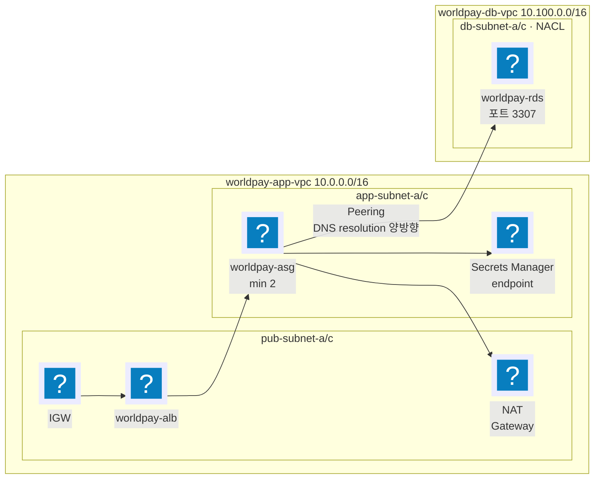

import { Quiz } from 'starlight-quiz/components';

> 문서 유형: explanation

4년 연속 나왔고 2026엔 1과제 배점의 31%(15.5/50)를 차지한다. 지방대회에서 가장 확실하게 회수할 수 있는 점수다.

2026 요구를 그림으로 두면 이렇다. 이 그림의 화살표 하나하나가 채점 항목이다.



**읽는 법.** app VPC 와 db VPC 는 Peering 으로만 이어져 있고, DB 서브넷에는 인터넷으로 나가는 길이 아예 없다. Secrets Manager 는 NAT 이 아니라 VPC 엔드포인트로 간다.

## 1. 4년간 무엇이 요구됐나

| | 2023 | 2024 | 2025 | 2026 |
| --- | --- | --- | --- | --- |
| VPC 수 | 1 | 1 | 1 | **2 + Peering** |
| CIDR | 10.0.0.0/16 | 10.100.0.0/16 | 10.101.0.0/16 | 10.0.0.0/16, 10.100.0.0/16 |
| 서브넷 계층 | public / private | public / private / **protected** | public / private | public / app / db |
| AZ | 2a, 2b | 2a, 2b | 2a, 2c | 2a, 2c |
| 서브넷 CIDR 지정 | 문제지가 줌 | 문제지가 줌 | **자유** | 문제지가 줌 |
| 라우팅 테이블 | 3개 (pub 1, priv 2) | 4개 | 3개 | 4개 |
| NAT | AZ별 1개씩 2개 | AZ별 1개씩 2개 | app 서브넷용 | app 서브넷용 |
| NACL | 없음 | 없음 | 없음 | **db 서브넷에 필수** |
| Flow Logs | 없음 | 없음 | 없음 | **두 VPC 모두** |
| VPC Endpoint | 없음 | 없음 | 없음 | **Secrets Manager** |
| Peering | 없음 | 없음 | 없음 | **DNS resolution 양방향** |

경향이 뚜렷하다. **네트워크 요구가 매년 한 층씩 두꺼워졌다.** 2026에서 처음 나온 NACL·Flow Logs·Endpoint·Peering은 다음에도 나올 가능성이 높다.

## 2. 왜 이렇게 나누는가

### 2-1. 세 층의 서브넷

| 층 | 인터넷으로 나가는 길 | 인터넷에서 들어오는 길 | 쓰는 곳 |
| --- | --- | --- | --- |
| public | IGW 직접 | 있음 (퍼블릭 IP) | ALB, NAT, Bastion |
| private / app | NAT Gateway 경유 | 없음 | 앱 서버, 컨테이너 |
| protected / db | 없음 | 없음 | DB |

핵심은 **라우팅 테이블의 `0.0.0.0/0` 이 어디를 가리키느냐** 하나다.

- public rt: `0.0.0.0/0 → igw-xxx`
- private rt: `0.0.0.0/0 → nat-xxx`
- protected/db rt: `0.0.0.0/0` 행이 **없다**

서브넷 자체에 "public/private" 속성이 있는 게 아니다. **어느 라우팅 테이블에 연결됐는지가 전부다.** 채점도 그렇게 본다.

```bash
# 2023 1-3 : "igw-" 로 시작하는지
aws ec2 describe-route-tables --filter Name=tag:Name,Values=wsi-public-rtb \
  --query "RouteTables[].Routes[].GatewayId"

# 2023 1-4 : "nat-" 로 시작하고, a와 b가 서로 다른 ID인지
aws ec2 describe-route-tables --filter Name=tag:Name,Values=wsi-private-rtb-a \
  --query "RouteTables[].Routes[].NatGatewayId"
```

### 2-2. NAT을 AZ마다 두는 이유

private 라우팅 테이블을 AZ별로 쪼개고 각각 자기 AZ의 NAT을 가리키게 하는 요구가 2023·2024·2026에 나왔다(`skills-private-rtb-a`/`-b`, `worldpay-app-rt-a`/`-c`).

이유는 둘이다.

1. **가용성** — NAT 하나가 있는 AZ가 죽으면 다른 AZ 앱까지 인터넷이 끊긴다.
2. **비용** — AZ를 넘는 트래픽에 교차 AZ 요금이 붙는다.

채점은 1)만 본다. `-rtb-a` 와 `-rtb-b` 의 NatGatewayId 가 서로 달라야 한다. **NAT 하나로 두 라우팅 테이블을 가리키면 이름은 맞아도 감점이다.**

### 2-3. NACL과 보안 그룹의 차이 (2026 신규)

2026이 처음으로 NACL을 요구했다. 보안 그룹으로 대신할 수 없다.

| | 보안 그룹 | NACL |
| --- | --- | --- |
| 붙는 대상 | ENI (인스턴스) | 서브넷 |
| 상태 | stateful — 나간 응답은 자동 허용 | **stateless — 돌아오는 응답도 규칙이 있어야 통과** |
| 규칙 | allow만 | allow + **deny** |
| 평가 | 전체를 보고 하나라도 맞으면 허용 | 규칙 번호 순, 처음 맞는 것에서 결정 |

2026 요구는 "DB 서브넷은 인터넷과 통신 불가, app 서브넷과의 통신만 허용"이고 채점은 이렇게 본다.

```bash
# inbound allow 규칙의 CIDR 목록에 0.0.0.0/0 이 없어야 한다
aws ec2 describe-network-acls --filter Name=tag:Name,Values=worldpay-db-nacl \
  --query "NetworkAcls[].Entries[?(!(Egress) && RuleAction=='allow')].CidrBlock" --output text

# outbound 도 마찬가지
aws ec2 describe-network-acls --filter Name=tag:Name,Values=worldpay-db-nacl \
  --query "NetworkAcls[].Entries[?(@.Egress && RuleAction=='allow')].CidrBlock" --output text
```

**함정 셋.**

1. 기본 NACL은 inbound·outbound 둘 다 `0.0.0.0/0 ALLOW` 다. 새 NACL을 만들어 붙여야 한다.
2. NACL은 stateless라 **outbound에 응답용 임시 포트(1024–65535) 허용을 넣어야** DB 응답이 돌아온다. 그런데 그 CIDR을 `0.0.0.0/0` 으로 쓰면 채점에서 죽는다 — **app 서브넷 CIDR(10.0.10.0/24, 10.0.11.0/24)로 적는다.**
3. NACL이 서브넷에 **연결(associate)** 되어 있어야 한다. 채점 1-8은 연결된 서브넷 ID가 2개 나오는지 본다.

### 2-4. VPC Peering과 DNS resolution (2026 신규)

Peering만 맺으면 IP로는 통신되지만 **상대 VPC의 프라이빗 DNS 이름이 프라이빗 IP로 안 풀린다.** RDS 엔드포인트(`worldpay-rds.cluster-xxx.ap-northeast-2.rds.amazonaws.com`)를 앱이 조회하면 퍼블릭 IP가 나오고, DB는 퍼블릭 액세스가 꺼져 있으니 연결이 실패한다.

그래서 양쪽 다 켜야 한다.

```bash
aws ec2 modify-vpc-peering-connection-options \
  --vpc-peering-connection-id pcx-xxx \
  --requester-peering-connection-options AllowDnsResolutionFromRemoteVpc=true \
  --accepter-peering-connection-options AllowDnsResolutionFromRemoteVpc=true
```

채점 1-7이 Accepter·Requester 양쪽 값이 모두 `True` 인지 본다. **한쪽만 켜면 0점이고, 앱도 안 붙는다.**

Peering을 맺은 뒤 **양쪽 VPC의 라우팅 테이블에 상대 CIDR 경로를 넣는 것**도 잊기 쉽다. Peering 연결 자체는 길을 만들지 않는다.

### 2-5. VPC Endpoint (2026 신규)

app 서브넷은 NAT을 통해 인터넷으로 나갈 수 있으므로 Secrets Manager 호출은 NAT 없이도 이미 된다. 그런데 문제는 "인터넷 외부를 거치지 않도록" 요구한다.

Secrets Manager는 **Interface 엔드포인트**(PrivateLink)다. Gateway 엔드포인트(S3·DynamoDB)와 다르다.

| | Gateway 엔드포인트 | Interface 엔드포인트 |
| --- | --- | --- |
| 대상 | S3, DynamoDB | 나머지 대부분 |
| 구현 | 라우팅 테이블에 prefix list 경로 추가 | 서브넷에 ENI 생성 |
| 비용 | 무료 | 시간당 + 데이터 |
| 필요한 것 | 라우팅 테이블 지정 | 서브넷 + **보안 그룹**, 프라이빗 DNS |

**보안 그룹에서 443 인바운드를 열지 않으면 엔드포인트는 만들어져도 호출이 타임아웃된다.** 채점(1-12)은 존재만 보므로 점수는 나오지만 앱이 죽는다.

서비스 이름은 `com.amazonaws.ap-northeast-2.secretsmanager` 다.

### 2-6. Flow Logs (2026 신규)

VPC 단위로 켜고 대상은 CloudWatch Logs 또는 S3다. 채점은 계정 전체를 훑는다.

```bash
aws ec2 describe-flow-logs --query FlowLogs[].ResourceId --output text
# → vpc id 두 개가 나와야 한다
```

**Default VPC에 연습으로 켜 둔 Flow log가 남아 있으면 세 개가 나온다.** 종료 전에 지운다.

CloudWatch Logs를 대상으로 하면 로그 그룹과 **Flow Logs가 그 그룹에 쓸 수 있는 IAM role** 이 함께 필요하다. 콘솔은 만들어 주지만 CLI로 하면 직접 만든다.

## 3. 훈련

### 3-1. 손에 붙여야 하는 순서

네트워크는 의존이 한 방향이라 순서를 외우면 끝난다.

```
VPC (CIDR)
 └ IGW 생성 + VPC에 attach
 └ 서브넷 (AZ, CIDR, Name 태그)
     └ NAT Gateway (public 서브넷에, EIP 필요)
 └ 라우팅 테이블 (Name 태그)
     └ 경로 추가 (0.0.0.0/0 → igw / nat / 없음)
     └ 서브넷 연결
 └ NACL 생성 → 규칙 → 서브넷 연결
 └ Flow Logs
 └ VPC Endpoint (Interface면 보안 그룹까지)
 └ Peering → 수락 → 양쪽 라우팅 경로 → DNS 옵션
```

**NAT Gateway는 만드는 데 2~3분 걸린다.** 만들어 두고 그 사이에 다른 걸 한다. 대회 4시간에서 대기 시간을 겹치는 게 실력이다.

### 3-2. 드릴 A — 2026 네트워크를 40분에

목표: 2026 1과제 1번 항목 15.5점 전부.

만들 것 — VPC 2개, 서브넷 6개, 라우팅 테이블 4개, IGW 1, NAT 1(또는 2), NACL 1, Flow Logs 2, Secrets Manager Endpoint 1, Peering 1.

검증: `mark.sh` 의 1-1~1-12를 돌려 12개 항목이 전부 기대값과 맞는지 본다.

3회 반복해 40분 안에 들어오면 합격이다.

### 3-3. 드릴 B — 이름표만 바꿔 다시

같은 구조를 이름표만 `2023 wsi-*`, `2024 skills-*`, `2025 ws-*` 로 바꿔 만든다. 이름표를 문제지에서 복사하는 습관, 그리고 **구조는 같고 이름만 다르다**는 감각을 붙이는 게 목적이다.

2024는 protected 층이 추가되므로 라우팅 테이블 4개 구조를 한 번 더 연습한다.

### 3-4. 진단 — 안 될 때 볼 곳

| 증상 | 먼저 볼 곳 |
| --- | --- |
| private 인스턴스에서 `yum update` 가 멈춤 | private rt의 `0.0.0.0/0` 이 NAT을 가리키는지 → NAT이 **public** 서브넷에 있는지 → NAT의 EIP |
| Bastion에 SSH가 안 붙음 | public rt의 IGW 경로 → 인스턴스 퍼블릭 IP → 보안 그룹 22 → NACL |
| 앱이 RDS에 못 붙음 (Peering 구성) | 양쪽 라우팅에 상대 CIDR 경로 → DNS resolution 양방향 → DB 보안 그룹 → **NACL outbound 임시 포트** |
| Secrets Manager 호출 타임아웃 | 엔드포인트 보안 그룹 443 → 프라이빗 DNS 활성화 → 엔드포인트가 앱 서브넷에 있는지 |
| 채점 출력이 빈 문자열 | Name 태그 철자 → 리전 → 필터 대상이 태그인지 이름인지 |

## 4. 자기 점검

<Quiz title="서브넷이 public 이 되는 조건">
어떤 서브넷을 "public" 으로 만드는 것은 무엇인가?

- [x] 그 서브넷이 연결된 라우팅 테이블에 `0.0.0.0/0 → IGW` 경로가 있는 것
- [ ] 서브넷 생성 시 public 옵션을 켜는 것
  > 그런 옵션은 없다. 콘솔의 "퍼블릭 IP 자동 할당"은 그 서브넷에 뜨는 인스턴스가 퍼블릭 IP 를 받느냐일 뿐, 나가는 길과는 별개다.
- [ ] 서브넷 안 인스턴스가 퍼블릭 IP 를 갖는 것
  > 퍼블릭 IP 가 있어도 라우팅 테이블에 IGW 경로가 없으면 인터넷과 통신할 수 없다.
- [ ] 서브넷 CIDR 이 VPC CIDR 의 앞쪽 대역인 것
  > CIDR 값은 아무 관계가 없다. 관례상 앞 대역을 public 에 쓸 뿐이다.

**라우팅 테이블 연결이 전부다.** 채점도 그렇게 본다 — 2023 채점 1-3 은 `wsi-public-rtb` 의 `Routes[].GatewayId` 가 `igw-` 로 시작하는지만 확인한다.
</Quiz>

<Quiz title="NACL outbound 임시 포트">
2026 db 서브넷 NACL 에서 app 서브넷의 응답이 돌아가게 하려면 outbound 에 무엇을 넣어야 하나?

- [x] 목적지 CIDR 을 app 서브넷(10.0.10.0/24, 10.0.11.0/24)으로 한 1024–65535 allow
- [ ] 넣을 필요 없다 — 들어온 연결의 응답은 자동으로 나간다
  > 그건 보안 그룹(stateful)의 동작이다. NACL 은 stateless 라 응답 방향에도 규칙이 있어야 한다.
- [ ] 목적지 `0.0.0.0/0` 인 1024–65535 allow
  > 동작은 하지만 채점 1-10 이 outbound allow 규칙의 CIDR 에 `0.0.0.0/0` 이 없는지 본다. 그 순간 1.5점을 잃는다.
- [ ] 목적지 app 서브넷인 3307 allow
  > 3307 은 요청이 들어오는 포트다. 응답은 클라이언트가 연 임시 포트로 돌아간다.

**app 서브넷 CIDR 로 좁힌 임시 포트 allow.** 동작과 채점을 동시에 만족하는 유일한 답이다.
</Quiz>

## 5. 참고 문서

- [VPC 사용자 가이드 — 서브넷과 라우팅](https://docs.aws.amazon.com/vpc/latest/userguide/configure-subnets.html) — 서브넷이 public이 되는 조건
- [NAT Gateway](https://docs.aws.amazon.com/vpc/latest/userguide/vpc-nat-gateway.html) — AZ별 배치와 요금
- [네트워크 ACL](https://docs.aws.amazon.com/vpc/latest/userguide/vpc-network-acls.html) — stateless와 임시 포트 절만 읽으면 된다
- [VPC Peering DNS 확인](https://docs.aws.amazon.com/vpc/latest/peering/modify-peering-connections.html) — DNS resolution 옵션
- [AWS PrivateLink 인터페이스 엔드포인트](https://docs.aws.amazon.com/vpc/latest/privatelink/create-interface-endpoint.html) — 보안 그룹 요구 조건
- [VPC Flow Logs](https://docs.aws.amazon.com/vpc/latest/userguide/flow-logs.html)
