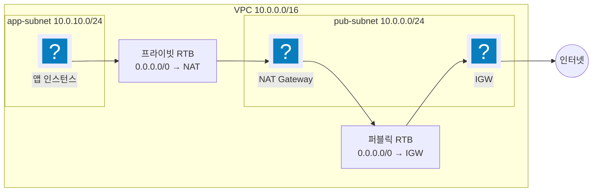

import { Quiz, QuizResults } from 'starlight-quiz/components';
import { Steps, LinkButton, Aside } from '@astrojs/starlight/components';

> 문서 유형: explanation

**선수 학습 2/15.** 앞선 문서를 전제하지 않는다. 처음 보는 사람 기준으로 씁니다.

## 이 문서를 왜 읽나

AWS 에서 서버를 만들면 그 서버는 어딘가에 놓인다. 그 "어딘가" 가 VPC 다.

**VPC 는 내가 AWS 안에 만든 나만의 네트워크**다. 집에 공유기를 놓고 랜선을 연결하는 것과 비슷한데, 전부 소프트웨어로 한다.

이걸 모르면 나머지가 전부 막힌다. 서버를 만들어도 인터넷이 안 되고, 데이터베이스에 못 붙고, 채점자가 접속을 못 한다. **4년 내내 나왔고 2026 엔 1과제 배점의 31%** 였던 이유다.

## ① 학습 목표

- [ ] CIDR 표기와 AZ 를 한 문장으로 설명할 수 있다
- [ ] 퍼블릭·프라이빗 서브넷의 차이를 **라우팅 테이블 기준**으로 구분한다
- [ ] 프라이빗 인스턴스가 인터넷으로 나가는 경로를 그릴 수 있다
- [ ] 보안 그룹과 NACL 의 차이(stateful / stateless)를 안다
- [ ] Gateway 엔드포인트와 Interface 엔드포인트를 구분한다

## ② 핵심 개념

### 먼저 푸는 표기 두 가지

**CIDR `10.0.0.0/16`.** 슬래시 앞은 대역이 시작하는 주소, 뒤 숫자는 32비트 중 앞에서 몇 비트가 고정인가다. `/16` 이면 `10.0` 이 고정이고 나머지가 자유라 `10.0.0.0`~`10.0.255.255` 65,536개다. **숫자가 클수록 대역이 좁다** — `/24` 는 256개.

**AZ (가용 영역).** 리전 안에서 물리적으로 떨어진 데이터센터 묶음이다. 서브넷 하나는 AZ 하나에만 속한다. 2 AZ 에 걸치려면 서브넷을 AZ 마다 하나씩 만든다. 지방 기출은 서울의 `ap-northeast-2a` 와 `2c` 를 쓴다(2023·2024 는 `2b`).

### 용어표

| 용어 | 한 줄 정의 |
| --- | --- |
| VPC | AWS 안의 격리된 가상 네트워크. CIDR 을 하나 갖는다 |
| 서브넷 | VPC 를 쪼갠 조각. AZ 하나에 속한다 |
| IGW (인터넷 게이트웨이) | VPC ↔ 인터넷 양방향 관문. VPC 당 1개 |
| NAT Gateway | 프라이빗 서브넷의 **아웃바운드 전용** 관문. **퍼블릭 서브넷에** 놓고 EIP 가 필요하다 |
| 라우팅 테이블 | "목적지 → 어디로" 규칙표. **서브넷에 연결(associate)** 한다 |
| 보안 그룹 | ENI(인스턴스) 단위 방화벽. **stateful** — 나간 것의 응답은 자동 허용 |
| NACL | 서브넷 단위 방화벽. **stateless** — 양방향 각각 규칙이 필요하고 deny 도 쓸 수 있다 |
| VPC 엔드포인트 | 인터넷을 거치지 않고 AWS 서비스에 닿는 통로 |
| VPC Peering | 두 VPC 를 잇는 1:1 연결. 라우팅은 따로 넣어야 한다 |

### 서브넷이 public 인지 정하는 것은 이름이 아니다

- **퍼블릭 서브넷** = 연결된 라우팅 테이블에 `0.0.0.0/0 → IGW` 가 있는 서브넷
- **프라이빗 서브넷** = `0.0.0.0/0 → NAT`
- **격리 서브넷(2024 protected, 2026 db)** = `0.0.0.0/0` 행이 아예 없음

콘솔의 "퍼블릭 IP 자동 할당" 은 별개다. 퍼블릭 IP 가 있어도 IGW 경로가 없으면 인터넷과 통신할 수 없다.

### 보안 그룹 vs NACL

| | 보안 그룹 | NACL |
| --- | --- | --- |
| 붙는 대상 | ENI | 서브넷 |
| 상태 | stateful | **stateless** |
| 규칙 | allow 만 | allow + **deny** |
| 평가 | 전부 보고 하나라도 맞으면 허용 | 규칙 번호 순, 처음 맞는 것에서 결정 |

stateless 라는 말의 실제 의미: 클라이언트가 임시 포트(1024–65535)를 열어 요청을 보내면 **응답은 그 임시 포트로 돌아온다.** NACL 은 그 방향에도 규칙이 있어야 통과시킨다.

## ③ 대회에서 어떻게 쓰이나

| 해 | 요구 |
| --- | --- |
| 2023 | `wsi-vpc` 10.0.0.0/16, **AZ 별 NAT 2개** |
| 2024 | `skills-vpc` 10.100.0.0/16, **3단 서브넷**(public/private/protected) |
| 2025 | `ws-vpc` 10.101.0.0/16, **서브넷 마스크 자유** |
| 2026 | **VPC 2개 + Peering**, NACL, Flow Logs, Secrets Manager 엔드포인트 |

이름표를 문제지에서 복사한다. 철자가 하나만 달라도 채점 필터에 안 걸린다. → [축 1](/axis/03-axis-network/)

## ④ 미니 실습 (40분)

<Steps>

1. VPC `연습-vpc` 10.20.0.0/16 을 만든다.

2. 서브넷 둘을 만든다 — `연습-pub-a` 10.20.0.0/24 (2a), `연습-priv-a` 10.20.10.0/24 (2a).

3. IGW 를 만들어 VPC 에 attach 하고, `연습-pub-rt` 에 `0.0.0.0/0 → IGW` 를 넣어 pub 서브넷에 연결한다.

4. pub 서브넷에 NAT Gateway 를 만든다(EIP 필요). `연습-priv-rt` 에 `0.0.0.0/0 → NAT` 를 넣어 priv 에 연결한다.

5. priv 서브넷에 EC2 를 띄우고 SSM 으로 접속해 `curl -I https://aws.amazon.com` 이 되는지 본다.

6. `연습-priv-rt` 의 `0.0.0.0/0` 경로를 지우고 다시 해 본다. **멈추는 것이 정상이다.**

</Steps>

**NAT Gateway 는 시간당 과금이다.** 실습이 끝나면 지운다.

## ⑤ 심화 개념

### NAT 을 AZ 마다 두는 이유

한 AZ 의 NAT 이 죽으면 그 NAT 을 가리키는 모든 프라이빗 서브넷이 아웃바운드를 잃는다. 그래서 프라이빗 라우팅 테이블을 AZ 별로 쪼갠다(`worldpay-app-rt-a` / `-rt-c`). 채점은 두 라우팅 테이블의 `NatGatewayId` 가 서로 다른지 본다.

### 엔드포인트 두 종류

| | Gateway | Interface (PrivateLink) |
| --- | --- | --- |
| 대상 | S3, DynamoDB | 나머지 대부분 |
| 구현 | 라우팅 테이블에 prefix list 경로 | 서브넷에 ENI |
| 비용 | 무료 | 시간당 + 데이터 |
| 안 될 때 | **라우팅**을 본다 | **보안 그룹 443** 을 본다 |

2026 Secrets Manager 엔드포인트는 Interface 다. 보안 그룹에서 443 을 안 열면 만들어져도 호출이 타임아웃된다.

### Peering 은 길을 만들지 않는다

Peering 을 맺고 수락해도 **양쪽 라우팅 테이블에 상대 CIDR 경로를 넣어야** 통신된다. 그리고 상대 VPC 의 프라이빗 DNS 이름을 프라이빗 IP 로 풀려면 `AllowDnsResolutionFromRemoteVpc` 를 **양쪽 다** 켠다.

### 경로가 겹칠 때

가장 구체적인(접두사가 긴) 경로가 이긴다. `10.100.0.0/16` 경로가 `0.0.0.0/0` 을 이긴다. 규칙 순서나 우선순위 필드는 없다.

## ⑥ 자기 점검 퀴즈

<Quiz title="NAT Gateway 배치">
NAT Gateway 는 어디에 두어야 하나?

- [x] 퍼블릭 서브넷 — NAT 자신이 IGW 로 나가야 한다
- [ ] 트래픽을 내보낼 프라이빗 서브넷 안
  > NAT 이 프라이빗에 있으면 NAT 자신이 나갈 길이 없다. 라우팅은 라우팅 테이블이 하는 일이라 같은 서브넷일 필요가 전혀 없다.
- [ ] VPC 에 직접 붙인다 — IGW 와 같은 방식
  > IGW 는 VPC 에 attach 하지만 NAT 은 서브넷에 만든다.
- [ ] 어디든 상관없다
  > 퍼블릭이어야 한다.

**퍼블릭 서브넷.** 그리고 AZ 별로 나눠야 AZ 장애가 격리된다.
</Quiz>

<Quiz title="stateless 가 뜻하는 것">
DB 서브넷 NACL 에서 인바운드 3307 만 허용하고 아웃바운드를 비워 두었다. 무슨 일이 일어나나?

- [x] 요청은 도착하지만 응답이 나가지 못해 연결이 끊긴다
- [ ] 정상 동작한다 — 들어온 연결의 응답은 자동 허용된다
  > 그것은 보안 그룹(stateful)의 동작이다. NACL 은 응답 방향에도 규칙이 필요하다.
- [ ] 요청 자체가 막힌다
  > 인바운드 3307 은 허용했으므로 요청은 들어온다.
- [ ] 아웃바운드가 비면 기본 허용이다
  > NACL 의 마지막 규칙은 `*` DENY 다. 명시적으로 허용해야 한다.

**응답은 클라이언트가 연 임시 포트(1024–65535)로 돌아간다.** 그 포트를 app 서브넷 CIDR 로 좁혀 허용한다.
</Quiz>

<QuizResults />

## ⑦ 다음 단계

<LinkButton href="/basics/03-iam/" icon="right-arrow">다음 — 03 IAM</LinkButton>
<LinkButton href="/axis/03-axis-network/" variant="minimal">축 1 — 네트워크</LinkButton>

## 공식 문서

- [Amazon VPC 사용 설명서](https://docs.aws.amazon.com/vpc/latest/userguide/) — 서브넷·라우팅·NAT 원문
- [서브넷 구성](https://docs.aws.amazon.com/vpc/latest/userguide/configure-subnets.html) — "Subnet routing" 절
- [네트워크 ACL](https://docs.aws.amazon.com/vpc/latest/userguide/vpc-network-acls.html) — stateless 와 임시 포트
- [VPC 엔드포인트](https://docs.aws.amazon.com/vpc/latest/privatelink/concepts.html)
