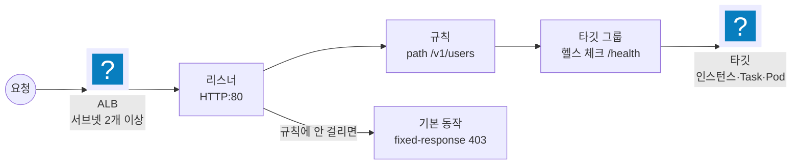

import { Quiz, QuizResults } from 'starlight-quiz/components';
import { Steps, LinkButton, Aside } from '@astrojs/starlight/components';

> 문서 유형: explanation

**선수 학습 5/15.** 앞선 문서를 전제하지 않는다. 처음 보는 사람 기준으로 씁니다.

## 이 문서를 왜 읽나

서버를 두 대 띄웠다고 하자. 사용자는 어느 쪽에 접속해야 할까? 그리고 한 대가 죽으면?

**로드밸런서는 그 앞에 서서 "지금 살아 있는 서버" 쪽으로 요청을 나눠 주는 장치**다. 사용자는 로드밸런서 주소 하나만 알면 된다.

대회에서 채점자의 명령어는 **전부 이 로드밸런서를 통해** 앱에 도착한다. 여기가 막히면 앱이 아무리 잘 떠 있어도 0점이라 반드시 이해하고 넘어간다.

## ① 학습 목표

- [ ] 리스너·규칙·타깃 그룹의 역할을 구분한다
- [ ] 헬스 체크가 `unhealthy` 일 때 볼 순서를 안다
- [ ] 기본 동작(default action)과 규칙의 차이를 안다
- [ ] `ELB_4XX` 와 `Target_4XX` 가 무엇이 다른지 안다

## ② 핵심 개념

### 네 조각



| 조각 | 하는 일 |
| --- | --- |
| 로드밸런서 | 어느 서브넷에 붙어 있고 어떤 보안 그룹을 쓰나. **AZ 2개 이상 필수** |
| 리스너 | 어떤 프로토콜·포트로 듣나(HTTP:80) |
| 규칙 | 조건(경로·호스트·헤더)에 맞으면 어디로 보낼지 |
| 기본 동작 | **어느 규칙에도 안 걸린 요청**을 어떻게 할지 |
| 타깃 그룹 | 실제 대상 묶음 + 헬스 체크 설정 |

### 기본 동작은 규칙이 아니다

2026 요구는 "정의되지 않은 경로는 403" 이다. 두 가지로 구현할 수 있지만 **채점이 읽는 필드가 다르다.**

```bash
aws elbv2 describe-listeners --load-balancer-arn $ALB_ARN \
  --query Listeners[].DefaultActions[].FixedResponseConfig.StatusCode --output text
# → 403
```

이 값은 **기본 동작**에서만 나온다. 기본 동작을 forward 로 두고 별도 규칙으로 403 을 주면 이 항목이 0이다.

### 헬스 체크

타깃 그룹이 주기적으로 각 타깃에 요청을 보내 살아 있는지 본다.

| 설정 | 기본값 | 대회에서 |
| --- | --- | --- |
| 경로 | `/` | **앱이 실제로 여는 경로로** 바꾼다(2025·2026 은 `/health`) |
| 포트 | 트래픽 포트 | 앱 포트(8080) |
| 성공 코드 | 200 | 그대로 |

```bash
aws elbv2 describe-target-health --target-group-arn <arn> \
  --query "TargetHealthDescriptions[].TargetHealth.State" --output text
```

`unhealthy` 면 볼 순서가 정해져 있다.

<Steps>

1. 인스턴스 안에서 앱이 답하나 — `curl localhost:8080/health`

2. 보안 그룹이 ALB 로부터 8080 을 받나

3. 헬스 체크 경로·포트가 맞나

4. 성공 코드가 맞나

</Steps>

**타깃 그룹이 전부 unhealthy 면 ALB 는 503 을 돌려준다.** 채점의 `curl` 이 503 을 받으면 앱 항목이 통째로 죽는다.

### 지표 두 종류

| 지표 | 누가 만든 응답인가 |
| --- | --- |
| `HTTPCode_ELB_4XX_Count` | **ALB 자신** — 규칙에 안 걸림, 잘못된 요청 |
| `HTTPCode_Target_4XX_Count` | **백엔드 앱** |
| `HTTP_Fixed_Response_Count` | 기본 동작·규칙의 fixed-response 가 나간 횟수 |

2025 채점 4-3 은 없는 경로로 20회 요청해 알람이 울리는지 본다. 그 경로가 타깃까지 갔다면 Target, ALB 가 막았다면 ELB 다. **대시보드에는 둘 다 넣어 두는 편이 안전하다.**

## ③ 대회에서 어떻게 쓰이나

| 해 | 요구 |
| --- | --- |
| 2023 | `wsi-alb` — `/about` 과 `/projects` 를 각각 다른 타깃 그룹으로 |
| 2024 | `skills-user-alb` internet-facing, CloudFront 가 `/api/*` 를 ALB 로 |
| 2025 | `gateway-alb-pub` + `/health` 200 |
| 2026 | `worldpay-alb` + **기본 동작 fixed-response 403** |

## ④ 미니 실습 (40분)

<Steps>

1. 앞 문서에서 만든 ASG 앞에 ALB 를 붙인다(서브넷 2개).

2. 타깃 그룹 헬스 체크 경로를 `/` 로 두고 상태가 healthy 인지 본다.

3. 경로를 `/health` 로 바꾼다. nginx 에는 그 경로가 없으므로 **unhealthy 가 되는 것을 확인한다.**

4. nginx 에 `/health` 를 추가하고 다시 healthy 가 되는지 본다.

5. 리스너 기본 동작을 fixed-response 403 으로 바꾸고, 규칙으로 `/` 만 forward 시킨다.

   ```bash
   curl -sI http://$ALB/        | head -n1   # 200
   curl -sI http://$ALB/nothing | head -n1   # 403
   ```

</Steps>

## ⑤ 심화 개념

### ALB 는 서브넷을 2개 이상 요구한다

만들 때부터 강제된다. 채점도 본다.

```bash
aws elbv2 describe-load-balancers --names worldpay-alb \
  --query LoadBalancers[].AvailabilityZones[].ZoneName --output text
```

### 보안 그룹 두 개를 나눠 쓴다

```
인터넷 ──80──▶ [ALB SG]  ──8080──▶ [앱 SG]
```

앱 SG 의 인바운드 소스를 CIDR 이 아니라 **ALB 의 보안 그룹 ID** 로 지정하는 것이 정석이다. ALB 의 사설 IP 가 바뀌어도 계속 동작한다.

### ARN 에서 대시보드용 값을 뽑는다

```bash
aws elbv2 describe-load-balancers --names worldpay-alb \
  --query LoadBalancers[].LoadBalancerArn --output text
# arn:aws:elasticloadbalancing:...:loadbalancer/app/worldpay-alb/1a2b3c4d
#                                               ^^^^^^^^^^^^^^^^^^^^^^^^^^ 이 뒷부분이 대시보드 차원 값
```

CloudWatch 대시보드의 `LoadBalancer` 차원에 `app/worldpay-alb/1a2b3c4d` 를 넣는다. → [축 5](/axis/07-axis-observability/)

### 경로 라우팅(2023)

규칙에 우선순위 숫자가 있고 **작은 값이 먼저** 평가된다. `/about` 과 `/projects` 를 각각 다른 타깃 그룹으로 보내되, 어느 쪽에도 안 걸리는 요청은 기본 동작으로 간다.

## ⑥ 자기 점검 퀴즈

<Quiz title="503 이 뜻하는 것">
채점자의 `curl` 이 503 을 받았다. 가장 먼저 볼 곳은?

- [x] 타깃 그룹의 타깃 상태 — 전부 unhealthy 면 ALB 가 503 을 만든다
- [ ] 앱 코드의 오류 처리
  > 앱까지 요청이 갔다면 앱의 응답 코드가 온다. 503 은 대개 ALB 가 만든 것이다.
- [ ] 보안 그룹의 인바운드 80
  > 80 이 막혔다면 응답 자체가 안 온다(타임아웃).
- [ ] RDS 연결
  > DB 문제라면 앱이 500 을 돌려준다. 앱이 아예 타깃에서 빠진 상태가 503 이다.

**503 = "보낼 타깃이 없다".** 헬스 체크부터 본다.
</Quiz>

<Quiz title="기본 동작과 규칙">
`DefaultActions[].FixedResponseConfig.StatusCode` 가 비어 있다. 왜인가?

- [x] 기본 동작이 fixed-response 가 아니라 forward 로 설정돼 있다
- [ ] 403 규칙을 아직 안 만들었다
  > 규칙으로 만든 403 은 `Rules` 쪽에 있고 `DefaultActions` 에는 안 나온다.
- [ ] 리스너가 HTTPS 여야 한다
  > 프로토콜과 무관하다.
- [ ] ALB 이름이 틀렸다
  > 이름이 틀리면 명령 자체가 빈 결과를 낸다. 이 경우는 필드만 비어 있다.

**규칙으로 만든 403 은 이 필드에 안 잡힌다.** 기본 동작 자체를 fixed-response 로 바꾼다.
</Quiz>

<QuizResults />

## ⑦ 다음 단계

<LinkButton href="/basics/06-container-ecs/" icon="right-arrow">다음 — 06 컨테이너·ECS</LinkButton>
<LinkButton href="/axis/05-axis-compute/" variant="minimal">축 3 — 앱 배포와 ALB</LinkButton>

## 공식 문서

- [ALB 리스너 규칙](https://docs.aws.amazon.com/elasticloadbalancing/latest/application/listener-update-rules.html) — 동작 유형과 기본 동작
- [대상 그룹 상태 확인](https://docs.aws.amazon.com/elasticloadbalancing/latest/application/target-group-health-checks.html)
- [ALB CloudWatch 지표](https://docs.aws.amazon.com/elasticloadbalancing/latest/application/load-balancer-cloudwatch-metrics.html) — ELB_4XX 와 Target_4XX
