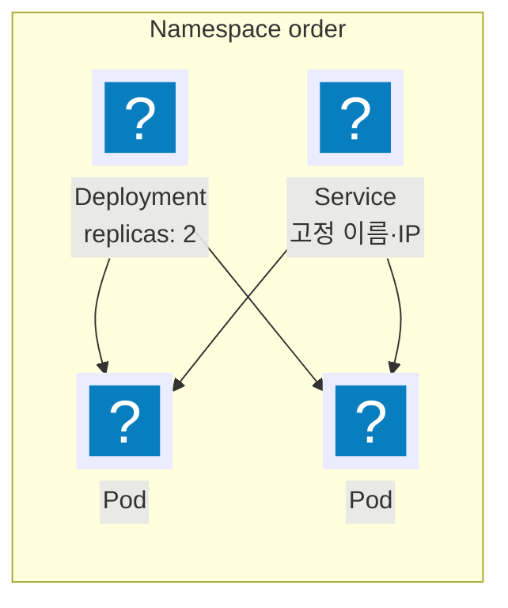

import { Quiz, QuizResults } from 'starlight-quiz/components';
import { Steps, LinkButton, Aside } from '@astrojs/starlight/components';

> 문서 유형: explanation

**선수 학습 7/15.** 앞선 문서를 전제하지 않는다. 처음 보는 사람 기준으로 씁니다.

## 이 문서를 왜 읽나

컨테이너가 열 개, 백 개가 되면 손으로 관리할 수 없다. **쿠버네티스는 그 많은 컨테이너를 대신 관리해 주는 시스템**이다. EKS 는 AWS 가 대신 운영해 주는 쿠버네티스고.

솔직히 말하면 쿠버네티스는 깊게 들어가면 끝이 없다. 다행히 **지방대회가 요구하는 깊이는 "클러스터를 띄우고 앱을 올려 자동으로 늘어나게 하는" 정도**다. 딱 거기까지만 다룬다.

## ① 학습 목표

- [ ] Pod·Deployment·Service·Namespace 를 구분한다
- [ ] `kubectl` 이 클러스터를 찾는 방법(kubeconfig)을 안다
- [ ] 노드그룹과 Fargate 프로파일의 차이를 안다
- [ ] 클러스터 엔드포인트의 public / private 설정이 무엇을 바꾸는지 안다
- [ ] Pod 를 늘리는 것과 Node 를 늘리는 것이 다른 일임을 안다

## ② 핵심 개념

### 리소스 네 가지



| 리소스 | 한 줄 정의 |
| --- | --- |
| Pod | 컨테이너 하나(또는 몇 개)를 묶은 **최소 실행 단위**. 죽으면 새로 만들어지고 IP 가 바뀐다 |
| Deployment | Pod 를 **몇 개 유지할까**를 담당. 이미지 교체·롤백을 관리 |
| Service | 바뀌는 Pod 앞에 붙는 **고정된 이름과 IP** |
| Namespace | 리소스를 가르는 논리적 칸. 2025 는 `order` |

ECS 와 대응시키면 Deployment ≈ 서비스, Pod ≈ 태스크다.

### kubeconfig

`kubectl` 은 `~/.kube/config` 를 보고 어느 클러스터에 무슨 자격으로 붙을지 정한다. EKS 는 명령 하나로 써 준다.

```bash
aws eks update-kubeconfig --name order-cluster --region ap-northeast-2
kubectl get nodes
```

**이 명령을 실행한 IAM 주체가 클러스터 접근 권한을 갖고 있어야 한다.** 클러스터를 만든 주체는 자동으로 갖지만, 다른 역할(예: Bastion 의 역할)로 붙으려면 접근 항목(access entry)이나 `aws-auth` 에 등록해야 한다. 2024 가 "Bastion 에서 kubectl 로 EKS 전체 권한" 을 요구한 것이 이것이다.

### 노드그룹과 Fargate 프로파일

| | 관리형 노드그룹 | Fargate 프로파일 |
| --- | --- | --- |
| 실체 | EC2 인스턴스 묶음(ASG 로 구현) | 서버가 안 보이는 실행 환경 |
| Pod 배치 | 스케줄러가 노드를 고른다 | **네임스페이스·라벨 셀렉터**로 매칭 |
| DaemonSet | 돈다 | **못 돈다** |
| 대회 | 2024 애드온용·앱용 2개, 2025 기본 | 2024 `token` 전용 |

2024 는 애드온 전용과 앱 전용 노드그룹을 나누라고 했다. **label 만으로는 안 되고 taint + toleration + nodeSelector 조합이 필요하다** — label 은 "여기 둘 수 있다" 일 뿐 "다른 것을 막는다" 가 아니다.

### 클러스터 엔드포인트

| 설정 | 뜻 |
| --- | --- |
| public | 인터넷에서 API 서버에 붙을 수 있다(기본값) |
| private | VPC 안에서만 붙을 수 있다 |

2024 는 private 만 열라고 했다. 그러면 **같은 VPC 안의 Bastion 에서만** `kubectl` 이 된다.

## ③ 대회에서 어떻게 쓰이나

| 해 | 요구 |
| --- | --- |
| 2024 | Private 클러스터, 노드그룹 2개 + Fargate 프로파일, 컨트롤 플레인 로그, Secret KMS 암호화, Pod·Node 동시 확장 |
| 2025 2과제 ② | `order-cluster` 1.31, 네임스페이스 `order`, Deployment `order-processor`, KEDA 로 SQS 기반 확장 |

## ④ 미니 실습 (60분 + 클러스터 생성 대기)

<Steps>

1. eksctl 로 클러스터를 만든다. **15~20분 걸린다** — 그 사이에 다른 문서를 본다.

   ```bash
   eksctl create cluster --name 연습-cluster --version 1.31 \
     --region ap-northeast-2 --nodes 2 --node-type t3.medium
   ```

2. 네임스페이스와 Deployment 를 만든다.

   ```bash
   kubectl create namespace order
   kubectl create deployment order-processor --image=public.ecr.aws/nginx/nginx:alpine -n order
   kubectl scale deployment order-processor --replicas=2 -n order
   ```

3. 환경 변수를 넣어 본다.

   ```bash
   kubectl set env deployment/order-processor -n order QUEUE_URL=https://example REGION_NAME=ap-northeast-2
   kubectl describe deployment -n order | grep -E "QUEUE_URL|REGION_NAME"
   ```

4. Service 를 만들고 Pod 하나를 지워 IP 가 바뀌어도 Service 이름은 그대로인지 본다.

5. **끝나면 반드시 지운다.** `eksctl delete cluster --name 연습-cluster`

</Steps>

## ⑤ 심화 개념

### Pod 를 늘리는 것과 Node 를 늘리는 것

| 무엇 | 누가 한다 |
| --- | --- |
| Pod 개수 | HPA (CPU·메모리 기준) 또는 **KEDA** (외부 지표 기준) |
| Node 개수 | Cluster Autoscaler 또는 Karpenter |

2024 요구 "user 애플리케이션이 Auto Scaling 되면 Pod 가 늘면서 Node 도 늘어야 한다" 는 **둘 다** 필요하다는 뜻이다. HPA 만 켜면 Pod 가 Pending 에 걸린 채 멈춘다.

### KEDA 는 HPA 를 대신 만들어 준다 (2025)

KEDA 는 SQS 큐 길이 같은 외부 지표를 읽어 내부적으로 HPA 를 만든다. 선수는 `ScaledObject` 만 쓴다.

```yaml
apiVersion: keda.sh/v1alpha1
kind: ScaledObject
metadata: { name: order-scaler, namespace: order }
spec:
  scaleTargetRef: { name: order-processor }
  minReplicaCount: 1
  cooldownPeriod: 60
  triggers:
    - type: aws-sqs-queue
      metadata:
        queueURL: <SQS URL>
        queueLength: "5"
        awsRegion: ap-northeast-2
```

**`cooldownPeriod` 기본값은 300초다.** 채점이 축소를 5분 안에 확인하므로 60초로 줄인다. → [2과제 카탈로그 A-2](/axis/08-task2-catalog/)

### IRSA

Pod 에 IAM 권한을 주는 방법이다. 서비스 계정에 역할 ARN 을 애노테이션으로 붙이면 그 서비스 계정을 쓰는 Pod 가 그 역할로 AWS 를 부른다. KEDA 오퍼레이터가 SQS 를 읽을 때 쓴다.

노드 인스턴스 역할에 권한을 주는 방법도 동작하지만, 그러면 그 노드의 **모든 Pod** 가 같은 권한을 갖는다.

### 컨트롤 플레인 로그 (2024)

API 서버·감사·인증·컨트롤러·스케줄러 다섯 종류를 CloudWatch 로 보낼 수 있다. 클러스터 설정에서 켠다.

## ⑥ 자기 점검 퀴즈

<Quiz title="Pod 가 Pending 에 멈춘다">
HPA 로 replicas 를 10 까지 늘렸는데 절반이 Pending 이다. 원인은?

- [x] 노드에 남은 자원이 없다 — Node 를 늘리는 장치(Cluster Autoscaler 등)가 없다
- [ ] HPA 설정이 잘못됐다
  > HPA 는 제 일을 했다. replicas 를 늘린 것까지가 HPA 의 역할이다.
- [ ] 이미지 태그가 틀렸다
  > 그러면 Pending 이 아니라 ImagePullBackOff 다.
- [ ] Service 가 없다
  > Service 는 Pod 스케줄링과 무관하다.

**Pod 를 늘리는 일과 Node 를 늘리는 일은 별개 장치다.** 2024 채점이 둘 다 확인한다.
</Quiz>

<Quiz title="Fargate 프로파일과 DaemonSet">
2024 문제지는 "DaemonSet 은 Fargate 를 제외한 모든 Node 에서 운용" 이라고 적었다. 왜인가?

- [x] Fargate 에는 노드 개념이 없어 DaemonSet 이 스케줄될 대상이 없다
- [ ] DaemonSet 이 Fargate 보다 비싸서
  > 비용 문제가 아니다.
- [ ] Fargate 가 특권 컨테이너를 막아서
  > 특권 제한도 있지만 DaemonSet 이 안 도는 직접적 이유는 노드 단위 배치가 불가능하기 때문이다.
- [ ] 문제지의 임의 제약이다
  > 쿠버네티스와 Fargate 의 구조적 제약이다.

**DaemonSet 은 "노드마다 하나" 를 뜻한다.** 노드가 없는 실행 환경에는 성립하지 않는다.
</Quiz>

<QuizResults />

## ⑦ 다음 단계

<LinkButton href="/basics/08-rds-mysql/" icon="right-arrow">다음 — 08 RDS·MySQL</LinkButton>
<LinkButton href="/axis/08-task2-catalog/" variant="minimal">2과제 카탈로그 — KEDA</LinkButton>

## 공식 문서

- [EKS 클러스터 엔드포인트 접근](https://docs.aws.amazon.com/eks/latest/userguide/cluster-endpoint.html)
- [Fargate 프로파일](https://docs.aws.amazon.com/eks/latest/userguide/fargate-profile.html) — 고려 사항 절
- [EKS 오토스케일링](https://docs.aws.amazon.com/eks/latest/userguide/autoscaling.html) — Cluster Autoscaler
- [서비스 계정 IAM 역할(IRSA)](https://docs.aws.amazon.com/eks/latest/userguide/iam-roles-for-service-accounts.html)
- [KEDA 배포](https://keda.sh/docs/latest/deploy/) · [SQS 스케일러](https://keda.sh/docs/latest/scalers/aws-sqs/)
