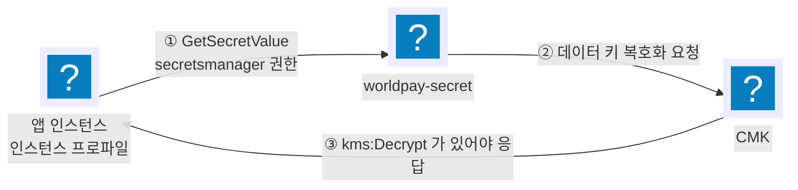

import { Quiz, QuizResults } from 'starlight-quiz/components';
import { Steps, LinkButton, Aside } from '@astrojs/starlight/components';

> 문서 유형: explanation

**선수 학습 10/15.** 앞선 문서를 전제하지 않는다. 처음 보는 사람 기준으로 씁니다.

## 이 문서를 왜 읽나

데이터베이스 비밀번호를 코드에 그대로 적어 두면 어떻게 될까? 코드를 보는 사람 누구나 그 비밀번호를 알게 된다.

**Secrets Manager 는 그런 비밀 값을 따로 보관해 주는 금고**고, **KMS 는 그 금고를 잠그는 열쇠를 관리하는 서비스**다.

여기가 이 사전 지식에서 가장 헷갈리는 부분인데, 이유가 있다. **금고 열쇠를 쓰려면 권한이 두 곳에 있어야 한다.** 2026 에서 "인스턴스는 켜져 있는데 앱만 안 뜨는" 사고의 대표 원인이 이것이라 꼭 짚고 넘어간다.

## ① 학습 목표

- [ ] AWS 소유·AWS 관리형·고객 관리형 키를 구분한다
- [ ] 봉투 암호화(envelope encryption)가 무엇인지 한 문장으로 말한다
- [ ] CMK 를 쓸 때 **왜 권한이 두 곳에 필요한지** 안다
- [ ] Secrets Manager 시크릿을 앱이 읽는 경로를 그릴 수 있다

## ② 핵심 개념

### 키 세 종류

| 종류 | 누가 만드나 | 키 정책을 내가 고치나 | 대회에서 |
| --- | --- | --- | --- |
| AWS 소유 키 | AWS | 못 본다 | 기본값. 대개 요구를 못 채운다 |
| AWS 관리형 (`aws/서비스명`) | AWS | 못 고친다 | 애매한 경우가 있다 |
| **고객 관리형 (CMK)** | 내가 | **고친다** | 문제지가 "CMK" 라고 적으면 이것 |

문제지가 "CMK 를 활용해" 라고 쓰면 직접 만든 키다. 만드는 데 1분이면 된다.

### 봉투 암호화

KMS 는 큰 데이터를 직접 암호화하지 않는다.

```
KMS 마스터 키(CMK)  ──암호화──▶  데이터 키
데이터 키           ──암호화──▶  실제 데이터(시크릿·EBS·S3 객체 …)
```

읽을 때는 반대다 — **암호화된 데이터 키를 KMS 에 보내 풀어 달라고 한다.** 이 호출이 `kms:Decrypt` 다. 그래서 "시크릿을 읽는다"는 동작이 실제로는 두 번의 권한 검사를 거친다.

### 권한이 두 곳에 필요하다



| 검사 | 어디에 적혀 있나 |
| --- | --- |
| ① 시크릿을 읽을 수 있나 | 호출자의 **IAM 정책** (`secretsmanager:GetSecretValue`) |
| ③ 이 키로 복호화할 수 있나 | 호출자의 **IAM 정책**(`kms:Decrypt`) **그리고** 키의 **키 정책** |

키 정책은 CMK 자체에 붙은 리소스 정책이다. 콘솔로 CMK 를 만들면 "키 사용자" 를 고르는 화면이 나오는데, 거기서 고른 주체가 키 정책에 들어간다. **앱의 인스턴스 역할을 여기에 넣지 않으면 IAM 정책만으로는 못 쓴다.**

두 곳 중 한 곳만 있으면 `AccessDeniedException` 이 나고, **인스턴스는 running 인데 앱만 안 뜬다.**

### Secrets Manager

| 항목 | 내용 |
| --- | --- |
| 저장 형태 | 문자열. 보통 JSON |
| 2026 형태 | `{"username":"app","password":"...","host":"worldpay-rds...."}` |
| 암호화 | 기본은 `aws/secretsmanager`. 문제지가 CMK 를 요구하면 바꾼다 |
| 읽기 | `aws secretsmanager get-secret-value --secret-id <이름> --query SecretString --output text` |

```bash
SECRET=$(aws secretsmanager get-secret-value --secret-id worldpay-secret \
  --query SecretString --output text)
DB_USER=$(echo "$SECRET" | jq -r .username)
```

## ③ 대회에서 어떻게 쓰이나

| 해 | 요구 |
| --- | --- |
| 2024 | ECR·EKS Secret·DocumentDB·ElastiCache 암호화, JWT 시크릿 `{"secretValue":"..."}` |
| 2025 | DynamoDB SSE 를 **CMK** 로 |
| 2026 | RDS·시크릿·DynamoDB·EFS·Lambda 코드 암호화, 시크릿 username ≠ `admin` |

## ④ 미니 실습 (30분)

<Steps>

1. CMK 를 만든다. 키 사용자에 **앱이 쓸 IAM 역할**을 포함시킨다.

2. 시크릿을 만든다 — 이름 `연습-secret`, 암호화 키를 그 CMK 로, 값은 JSON.

   ```json
   {"username": "app", "password": "1q2w3e4r", "host": "example.rds.amazonaws.com"}
   ```

3. EC2 를 하나 띄우고 그 역할을 붙인다. 역할에는 `secretsmanager:GetSecretValue` **만** 준다.

4. 인스턴스에서 읽어 본다. **거부되는 것**을 확인한다.

   ```bash
   aws secretsmanager get-secret-value --secret-id 연습-secret --query SecretString --output text
   ```

5. 역할에 `kms:Decrypt` 를 추가하고 다시 해 본다. 성공하는지 본다.

6. 이번엔 키 정책에서 그 역할을 빼고 다시 해 본다. **또 거부되는 것**을 확인한다.

</Steps>

4번과 6번이 서로 다른 이유로 실패한다는 것을 몸으로 확인하는 것이 이 실습의 전부다.

## ⑤ 심화 개념

### 오류 메시지로 어디가 문제인지 가른다

| 메시지 | 어디 |
| --- | --- |
| `is not authorized to perform: secretsmanager:GetSecretValue` | 호출자 IAM 정책 |
| `is not authorized to perform: kms:Decrypt` | 호출자 IAM 정책 (KMS 부분) |
| `The ciphertext refers to a customer master key that does not exist...` 또는 KMS 쪽 AccessDenied | **키 정책** |

### 시크릿 값에 무엇을 넣나

2026 은 `username`·`password`·`host` 셋을 예시로 준다. **실제로 접속되는 값을 넣는다** — 채점이 값을 눈으로 보고, 앱은 그 값으로 붙는다. 둘 다 만족해야 한다. → [08 RDS·MySQL](/basics/08-rds-mysql/)

### 시크릿을 VPC 안에서 읽기

2026 은 "인터넷 외부를 거치지 않도록" PrivateLink 엔드포인트를 요구했다. 엔드포인트의 **보안 그룹에서 443 을 열지 않으면** 호출이 조용히 타임아웃된다. 채점은 엔드포인트 존재만 보므로 점수는 나오고 앱은 죽는다. → [02 VPC](/basics/02-vpc/)

### Lambda 코드 암호화 (2026 2과제 ④)

함수 코드 묶음 자체를 CMK 로 암호화한다.

```bash
aws lambda get-function --function-name store-manager --query Code.SourceKMSKeyArn --output text
```

Lambda 실행 역할에 `kms:Decrypt` 가 있어야 함수가 뜬다. 여기서도 같은 구조다.

### 키를 지우는 데는 대기 기간이 있다

CMK 삭제는 최소 7일 대기다. 연습 계정을 비울 때 즉시 사라지지 않는다 — 놀라지 않는다.

## ⑥ 자기 점검 퀴즈

<Quiz title="시크릿 조회가 거부된다">
인스턴스 역할에 `secretsmanager:GetSecretValue` 를 줬는데도 CMK 로 암호화된 시크릿 조회가 거부된다. 확인할 곳을 **모두** 고르시오.

- [x] 역할의 IAM 정책에 `kms:Decrypt` 가 있는지
- [x] CMK 의 키 정책에 그 역할이 키 사용자로 들어 있는지
- [ ] 시크릿의 리소스 정책
  > 시크릿에도 리소스 정책을 붙일 수 있지만 기본값은 비어 있고 계정 내 접근을 막지 않는다.
- [ ] 시크릿 이름의 철자
  > 이름이 틀리면 `ResourceNotFoundException` 이지 AccessDenied 가 아니다.

**CMK 는 권한이 두 곳에 필요하다.** 한 곳만 있으면 인스턴스는 살아 있고 앱만 안 뜬다.
</Quiz>

<Quiz title="봉투 암호화">
KMS 가 시크릿 본문을 직접 암호화하지 않고 데이터 키를 거치는 이유는?

- [x] KMS 는 작은 데이터만 처리하고, 큰 데이터는 데이터 키로 로컬에서 암·복호화하는 편이 빠르고 싸다
- [ ] KMS 가 문자열을 지원하지 않아서
  > 4KB 이하 문자열은 직접 암호화할 수 있다.
- [ ] 데이터 키가 없으면 감사 로그가 안 남아서
  > 감사와 무관하다.
- [ ] 리전 간 복제를 위해서
  > 다중 리전 키는 별개 기능이다.

**KMS 호출은 네트워크 왕복이다.** 큰 데이터를 매번 보내지 않으려고 키만 주고받는다.
</Quiz>

<QuizResults />

## ⑦ 다음 단계

<LinkButton href="/basics/11-cloudwatch/" icon="right-arrow">다음 — 11 CloudWatch</LinkButton>
<LinkButton href="/axis/06-axis-data/" variant="minimal">축 4 — 데이터 저장소</LinkButton>

## 공식 문서

- [KMS 개념](https://docs.aws.amazon.com/kms/latest/developerguide/concepts.html) — 봉투 암호화와 데이터 키
- [키 정책](https://docs.aws.amazon.com/kms/latest/developerguide/key-policies.html) — IAM 정책과 함께 필요한 이유
- [Secrets Manager 암호화](https://docs.aws.amazon.com/secretsmanager/latest/userguide/security-encryption.html) — "Permissions for the KMS key" 절
- [Lambda 배포 패키지 암호화](https://docs.aws.amazon.com/lambda/latest/dg/encrypt-zip-package.html)
