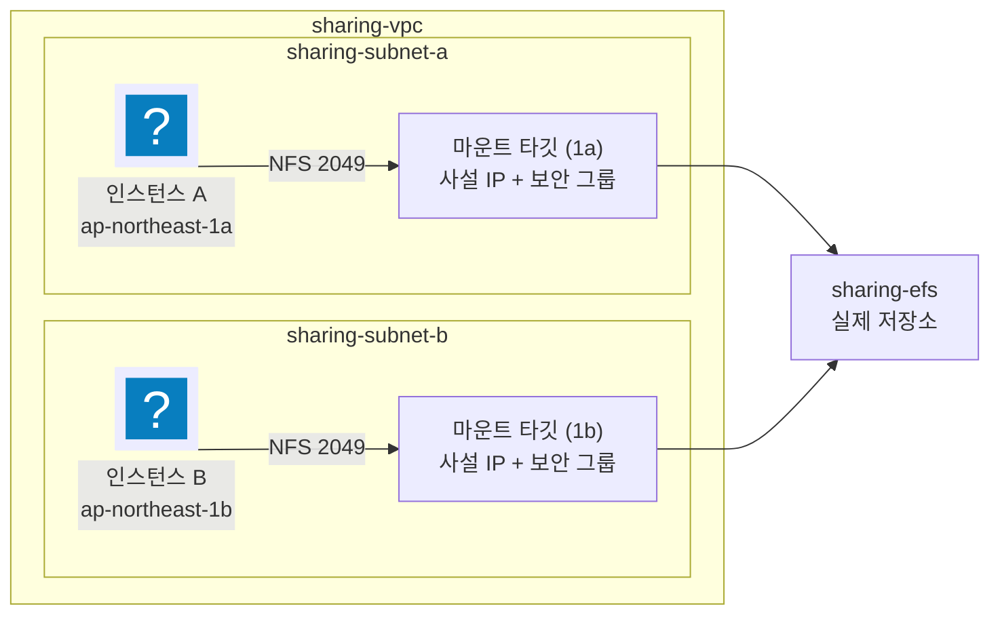

import { Quiz, QuizResults } from 'starlight-quiz/components';
import { Steps, LinkButton, Aside } from '@astrojs/starlight/components';

> 문서 유형: explanation

**선수 학습 12/15.** 앞선 문서를 전제하지 않는다. 처음 보는 사람 기준으로 씁니다.

<Aside type="note" title="이 문서는 지방대회용으로 새로 썼다">
전국판 skills-guide 에는 EFS 문서가 없다. 2026 지방 2과제 ① 에 처음 나와서 새로 만들었다.
</Aside>

## 이 문서를 왜 읽나

서버를 두 대 띄웠다고 하자. 1번 서버에 파일을 하나 만들면 2번 서버에서 보일까?

**안 보인다.** 서버마다 자기 디스크가 따로 있기 때문이다. 컴퓨터 두 대에 각각 USB 를 꽂은 것과 같다.

EFS 는 이 문제를 푼다. **한 개의 저장소를 여러 서버가 동시에 꽂아 쓰는 것**이다. 학교 컴퓨터실에서 모두가 같은 공용 폴더를 쓰는 것과 비슷하다.

## ① 학습 목표

- [ ] EFS 와 EBS 의 차이를 한 문장으로 말할 수 있다
- [ ] "마운트" 가 무슨 뜻인지 안다
- [ ] 마운트 타깃과 보안 그룹 2049 가 왜 필요한지 안다
- [ ] `/etc/fstab` 에 넣는 것과 손으로 마운트하는 것의 차이를 안다
- [ ] 수명 주기(IA 전환)가 무엇인지 안다

## ② 핵심 개념

### EBS 와 EFS

| | EBS | EFS |
| --- | --- | --- |
| 비유 | 컴퓨터에 꽂은 **내 USB** | 교실의 **공용 폴더** |
| 붙는 대상 | 인스턴스 **한 대** | 여러 대가 **동시에** |
| AZ | 같은 AZ 안에서만 | 여러 AZ 에서 |
| 프로토콜 | 블록 디바이스 | **NFS** (네트워크 파일 시스템) |
| 크기 | 미리 정한다 | 쓰는 만큼 자동으로 늘어난다 |

EC2 를 만들면 기본으로 붙는 디스크는 EBS 다. EFS 는 따로 만들어서 **네트워크로 연결**한다.

### "마운트" 가 뭔가

리눅스는 저장 장치를 **폴더에 연결해서** 쓴다. 그 연결 작업이 마운트다.

```bash
mount -t efs fs-abc123:/ /mnt/efs
#            ↑ 어떤 저장소를        ↑ 어느 폴더에 연결할지
```

이렇게 하면 `/mnt/efs` 안에 뭘 만들든 실제로는 EFS 에 저장된다. 다른 서버도 같은 EFS 를 `/mnt/efs` 에 마운트하면 **같은 파일이 보인다.**

<Aside type="tip" title="윈도우로 치면">
네트워크 드라이브를 `Z:` 로 연결하는 것과 같다. `Z:` 는 내 컴퓨터 안이 아니라 서버에 있고, 다른 사람도 같은 `Z:` 를 본다.
</Aside>

### 마운트 타깃

EFS 자체는 VPC 밖에 있는 서비스다. VPC 안의 서버가 닿으려면 **VPC 안에 접속 창구**가 필요하다. 그것이 마운트 타깃이다.



**AZ 마다 하나씩** 만든다. 2026 채점 1-7 이 `ap-northeast-1a` 와 `1b` 가 둘 다 나오는지 본다.

### 보안 그룹 2049

NFS 가 쓰는 포트 번호가 **2049** 다. 마운트 타깃의 보안 그룹이 인스턴스로부터 2049 를 받지 않으면 `mount` 명령이 **한참 멈췄다가 실패**한다.

<Aside type="danger" title="가장 흔한 사고">
마운트가 안 될 때 열에 아홉은 2049 다. 오류 메시지가 친절하지 않고 그냥 멈춰 있어서 원인을 찾기 어렵다. **먼저 보안 그룹부터 본다.**
</Aside>

### 손으로 마운트 vs fstab

| 방법 | 재부팅하면 | 새 인스턴스에서는 |
| --- | --- | --- |
| `mount` 명령을 직접 침 | 사라진다 | 안 된다 |
| `/etc/fstab` 에 적어 둠 | 유지된다 | **user data 에 넣어야 자동으로 된다** |

2026 채점 1-8 은 **인스턴스를 전부 지우고** ASG 가 새로 띄운 것에서 확인한다. 그래서 손으로 마운트한 것은 아무 소용이 없다. Launch Template 의 user data 에 들어 있어야 한다.

```bash
#!/bin/bash
dnf install -y amazon-efs-utils
mkdir -p /mnt/efs
echo "fs-abc123:/ /mnt/efs efs _netdev,tls 0 0" >> /etc/fstab
mount -a
```

| 조각 | 뜻 |
| --- | --- |
| `amazon-efs-utils` | EFS 전용 마운트 도우미 패키지 |
| `_netdev` | 네트워크가 준비된 뒤에 마운트하라 |
| `tls` | 전송 구간을 암호화한다 |
| `mount -a` | fstab 에 적힌 것을 지금 바로 마운트 |

### 수명 주기 (IA 전환)

오래 안 쓴 파일을 더 싼 등급으로 옮기는 기능이다. IA 는 Infrequent Access(자주 안 쓰는) 의 약자다.

```bash
aws efs put-lifecycle-configuration --file-system-id fs-abc123 \
  --lifecycle-policies TransitionToIA=AFTER_30_DAYS
```

2026 요구가 정확히 이것이다("30일이 지나면 IA storage class 를 사용").

## ③ 대회에서 어떻게 쓰이나

2026 2과제 ①, **도쿄(ap-northeast-1)** 리전. 12.5점.

| 채점 | 내용 |
| --- | --- |
| 1-4 | `aws efs describe-file-systems --query FileSystems[].Name` → `sharing-efs` |
| 1-5 | `Encrypted` 가 `True` |
| 1-6 | `TransitionToIA` 가 `AFTER_30_DAYS` |
| 1-7 | 마운트 타깃이 `1a`·`1b` 둘 다 |
| 1-8 | **인스턴스 전부 종료 후** 새 인스턴스에서 `df \| grep /mnt/efs` |
| 1-9 | 한 인스턴스에서 파일 생성 |
| 1-10 | **다른 인스턴스에서** 그 파일이 보이는지 |

1-8·1-9·1-10 은 연쇄다. 자동 마운트가 안 되면 4.5점이 통째로 날아간다.

<Aside type="caution" title="EFS 의 Name 은 태그다">
`FileSystems[].Name` 이라는 필드로 나오지만 실제로는 Name **태그**다. 태그를 안 붙이면 이 필드가 비어서 채점에 안 걸린다.
</Aside>

## ④ 미니 실습 (40분)

<Steps>

1. VPC 와 서브넷 2개(서로 다른 AZ)를 만든다. 인스턴스가 SSM 으로 붙을 수 있게 인터넷 경로도 만든다.

2. 보안 그룹 두 개를 만든다.

   - `연습-ec2-sg` — 특별한 인바운드 없음
   - `연습-efs-sg` — **인바운드 2049 를 `연습-ec2-sg` 로부터** 허용

3. EFS 를 만든다. 암호화를 켜고, 마운트 타깃을 서브넷 두 곳에 만들면서 `연습-efs-sg` 를 지정한다.

4. Launch Template 의 user data 에 위 마운트 스크립트를 넣고 ASG 를 min 2 로 만든다.

5. SSM 으로 인스턴스 A 에 붙어 확인한다.

   ```bash
   sudo su -
   df -h | grep /mnt/efs
   echo "hello" > /mnt/efs/test.txt
   ```

6. 인스턴스 B 에 붙어 같은 파일이 보이는지 본다.

   ```bash
   cat /mnt/efs/test.txt      # hello
   ```

7. **인스턴스를 전부 종료하고** ASG 가 새로 띄운 인스턴스에서 5번을 다시 해 본다. 이게 채점 방식이다.

</Steps>

6번에서 파일이 안 보이면 두 인스턴스가 서로 다른 EFS 를 보고 있는 것이다. `df` 출력의 파일 시스템 ID 를 비교한다.

## ⑤ 심화 개념

### 마운트가 멈출 때 보는 순서

<Steps>

1. **보안 그룹 2049** — 마운트 타깃 SG 가 인스턴스 SG 로부터 받는가

2. **마운트 타깃이 그 AZ 에 있는가** — 인스턴스가 있는 AZ 에 타깃이 없으면 못 붙는다

3. **`amazon-efs-utils` 가 설치됐는가** — `tls` 옵션은 이 패키지의 `stunnel` 을 쓴다

4. **user data 가 실제로 돌았는가** — `cat /var/log/cloud-init-output.log`

</Steps>

### `tls` 옵션과 stunnel

`tls` 를 붙이면 통신이 암호화된다. 이때 내부적으로 `stunnel` 이라는 프로그램을 쓰는데, `amazon-efs-utils` 를 설치하지 않으면 이 옵션이 조용히 실패한다. **설치를 user data 첫 줄에 둔다.**

### 저장 암호화는 생성 시점에만

EFS 를 만들 때 켜야 한다. 나중에 못 바꾼다. RDS·EBS 와 같은 성질이다. → [08 RDS](/basics/08-rds-mysql/)

### 성능 모드는 건드리지 않는다

EFS 에는 성능 모드·처리량 모드 설정이 있지만 대회에서 요구된 적이 없다. **기본값을 그대로 둔다** — 요구되지 않은 설정을 바꾸는 것은 시간 낭비이고 실수의 원인이다.

## ⑥ 자기 점검 퀴즈

<Quiz title="마운트가 멈춘다">
`mount -a` 가 한참 멈췄다가 실패한다. 가장 먼저 볼 곳은?

- [x] 마운트 타깃의 보안 그룹에 2049 인바운드가 있는지
- [ ] EFS 의 저장 암호화 설정
  > 암호화는 마운트 가능 여부와 무관하다.
- [ ] `/mnt/efs` 폴더가 존재하는지
  > 폴더가 없으면 곧바로 오류가 난다. 멈춰 있는 것은 네트워크 문제의 신호다.
- [ ] EFS 의 수명 주기 설정
  > IA 전환은 요금 문제라 접속과 무관하다.

**멈춘다 = 네트워크가 안 닿는다.** 오류가 빨리 나면 설정 문제, 오래 멈추면 보안 그룹이나 라우팅이다.
</Quiz>

<Quiz title="채점 1-8 을 통과하려면">
2026 채점은 인스턴스를 전부 종료한 뒤 새로 뜬 인스턴스에서 `df | grep /mnt/efs` 를 본다. 통과하는 방법은?

- [x] Launch Template 의 user data 에 마운트 스크립트를 넣는다
- [ ] SSM 으로 붙어 손으로 `mount` 한다
  > 그 인스턴스는 채점 전에 종료된다. 새 인스턴스에는 아무것도 남지 않는다.
- [ ] 인스턴스에 접속해 `/etc/fstab` 만 수정한다
  > 같은 이유로 사라진다. fstab 은 **user data 안에서** 작성해야 새 인스턴스에도 생긴다.
- [ ] EFS 콘솔에서 자동 마운트 버튼을 누른다
  > 그런 버튼은 없다. 콘솔이 만들어 주는 것은 마운트 명령 예시뿐이다.

**"새로 뜬 인스턴스에도 자동으로" 가 요구의 핵심이다.** 그래서 user data 다.
</Quiz>

<QuizResults />

## ⑦ 다음 단계

<LinkButton href="/basics/13-athena-glue/" icon="right-arrow">다음 — 13 Athena·Glue</LinkButton>
<LinkButton href="/axis/08-task2-catalog/" variant="minimal">2과제 카탈로그 — 공유 스토리지</LinkButton>

## 공식 문서

- [EFS 시작하기](https://docs.aws.amazon.com/efs/latest/ug/getting-started.html)
- [마운트 대상과 네트워크 접근](https://docs.aws.amazon.com/efs/latest/ug/network-access.html) — 2049 포트 절
- [부팅 시 자동 마운트](https://docs.aws.amazon.com/efs/latest/ug/mount-fs-auto-mount-onreboot.html) — fstab 형식
- [수명 주기 관리](https://docs.aws.amazon.com/efs/latest/ug/lifecycle-management-efs.html)
- [amazon-efs-utils](https://docs.aws.amazon.com/efs/latest/ug/installing-amazon-efs-utils.html)
