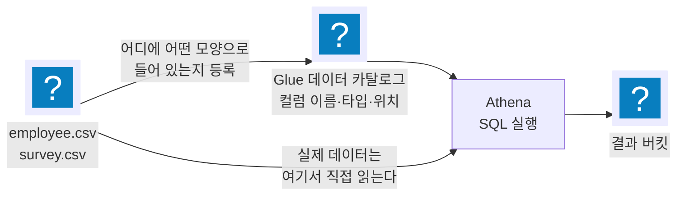

import { Quiz, QuizResults } from 'starlight-quiz/components';
import { Steps, LinkButton, Aside } from '@astrojs/starlight/components';

> 문서 유형: explanation

**선수 학습 13/15.** 앞선 문서를 전제하지 않는다. 처음 보는 사람 기준으로 씁니다.

<Aside type="note" title="이 문서는 지방대회용으로 새로 썼다">
전국판 skills-guide 에는 Athena 문서가 없다. 2026 지방 2과제 ② 에 나와서 새로 만들었다.
</Aside>

## 이 문서를 왜 읽나

엑셀 파일 같은 표 데이터가 S3 에 잔뜩 쌓여 있다고 하자. 여기서 "연봉이 7만 이상인 사람들의 만족도 평균" 을 구하려면?

보통은 데이터베이스에 넣고 SQL 을 쓴다. 그런데 **파일을 옮기지 않고 S3 에 둔 채로 SQL 을 쓰는** 방법이 있다. 그게 Athena 다.

<Aside type="tip" title="한 줄 요약">
**Glue = 파일이 어떻게 생겼는지 적어 두는 곳. Athena = 그 설명서를 보고 SQL 을 실행하는 곳.**
</Aside>

## ① 학습 목표

- [ ] Glue 데이터 카탈로그가 무엇을 저장하는지 안다
- [ ] Athena 가 데이터를 어디서 읽는지 안다
- [ ] CSV 첫 줄(헤더)을 처리하지 않으면 무슨 일이 생기는지 안다
- [ ] 워크그룹의 스캔 제한과 결과 위치가 무엇인지 안다
- [ ] 저장된 쿼리(saved query)를 만들 줄 안다

## ② 핵심 개념

### 전체 그림



핵심은 **데이터가 옮겨 다니지 않는다**는 것이다. CSV 는 계속 S3 에 있고, Glue 에는 "그 파일이 어떤 컬럼을 가졌는지" 설명만 들어간다.

### 용어표

| 말 | 쉽게 말하면 |
| --- | --- |
| Glue 데이터베이스 | 표 설명서를 담는 폴더. 2026 은 `research` |
| Glue 테이블 | 표 하나에 대한 설명서. 컬럼 이름·타입·**S3 경로** |
| 크롤러 | S3 를 훑어 테이블을 자동으로 만들어 주는 도구 |
| Athena 워크그룹 | 쿼리를 돌리는 작업 공간. 결과 위치·비용 한도를 여기에 정한다 |
| 저장된 쿼리 | 이름을 붙여 저장해 둔 SQL 문 |

<Aside type="caution" title="테이블 = 폴더">
Glue 테이블의 위치는 파일 하나가 아니라 **폴더**다. `s3://버킷/employee/` 를 가리키면 그 폴더 안의 모든 파일을 한 표로 본다. 2026 이 CSV 를 `employee/` 와 `survey/` 로 나눠 올리라고 한 이유다.
</Aside>

### 헤더 한 줄이 만드는 사고

CSV 첫 줄은 보통 컬럼 이름이다.

```
emp_id,name,salary      ← 이 줄이 헤더
101,Kim Minsoo,55000
102,Lee Jihyun,62000
```

Glue 에게 "첫 줄은 데이터가 아니다" 라고 알려 주지 않으면, **`name` 컬럼에 문자열 `"name"` 이 들어간 행이 하나 생긴다.**

알려 주는 방법은 테이블 속성 한 줄이다.

```sql
TBLPROPERTIES ('skip.header.line.count'='1')
```

2026 채점이 이걸 확인하는 방식이 재미있다.

```sql
select * from research.employee where name = 'name'
```

`name` 이라는 값을 가진 행을 찾는 쿼리다. 헤더를 제대로 건너뛰었다면 **하나도 안 나온다.**

### Athena 워크그룹

| 설정 | 무엇 | 2026 요구 |
| --- | --- | --- |
| 결과 위치 | 쿼리 결과 CSV 를 저장할 S3 경로 | `korea-skills-research-result-<비번호>` |
| 쿼리당 데이터 스캔 제한 | 이 크기를 넘으면 쿼리를 취소 | **1GB = 1073741824 바이트** |

<Aside type="danger" title="1GB 는 1073741824 다">
1000000000 이 아니다. Athena 는 2진 단위를 쓴다(1024 × 1024 × 1024). 채점이 이 숫자를 그대로 대조한다.
</Aside>

### 결과 컬럼 이름

```sql
-- 이렇게 쓰면 컬럼 이름이 _col0 이 된다
SELECT AVG(response) FROM research.survey;

-- 별칭을 붙여야 result 가 된다
SELECT AVG(CAST(response AS DOUBLE)) AS result FROM research.survey;
```

2026 은 "쿼리 결과는 result 라는 column 하나만 존재해야 합니다" 를 요구한다. `AS result` 를 빠뜨리면 조건이 깨진다.

`CAST` 가 필요한 이유는 크롤러가 컬럼을 문자열로 잡아 두는 경우가 있기 때문이다. 문자열끼리는 평균을 못 낸다.

## ③ 대회에서 어떻게 쓰이나

2026 2과제 ②, 서울 리전, 12.5점.

| 채점 | 내용 |
| --- | --- |
| 2-1·2-2 | 데이터 버킷·결과 버킷이 있는지 |
| 2-3 | 스캔 제한이 `1073741824` 인지 |
| 2-4 | 결과 위치가 결과 버킷을 가리키는지 |
| 2-5·2-6 | Glue 테이블 `employee`·`survey` 가 있는지 |
| 2-7 | **헤더 처리** — `where name = 'name'` 결과 줄 수가 3 |
| 2-8 | 저장된 쿼리 이름이 `research-query1`·`research-query2` |
| 2-9·2-10 | 두 쿼리를 실행한 결과값 |

<Aside type="danger" title="채점기준의 기대값과 실제 데이터가 다르다">
채점기준은 2-9 를 3.8, 2-10 을 4.5 로 적었다. 그런데 **배포된 CSV 로 계산하면 4.05 와 4.333…** 이다.

대회장에서 숫자가 안 맞는다고 쿼리를 고치면 오히려 틀린다. 쿼리를 데이터 기준으로 맞게 쓰고, 계산 근거를 남겨 이의신청 자료로 쓴다. → [채점 해부 7절](/exam/02-scoring/)
</Aside>

2023 2과제에도 Glue 가 나왔다(크롤러 + Job + 워크플로). Athena 없이 Glue 만 쓰는 형태였다.

## ④ 미니 실습 (50분)

<Steps>

1. 버킷 두 개를 만든다 — 데이터용, 결과용.

2. CSV 두 개를 만들어 각각 `employee/` 와 `survey/` 폴더로 올린다.

   ```
   employee.csv:  emp_id,name,salary   / 101,Kim,55000 …
   survey.csv:    emp_id,response      / 101,5 …
   ```

3. Athena 콘솔에서 워크그룹 `연습-wg` 를 만든다. 결과 위치를 결과 버킷으로, 스캔 제한을 1GB 로 둔다.

4. 테이블을 만든다. 콘솔의 쿼리 편집기에 그대로 붙여 넣는다.

   ```sql
   CREATE EXTERNAL TABLE research.employee (
     emp_id string, name string, salary string
   )
   ROW FORMAT DELIMITED FIELDS TERMINATED BY ','
   LOCATION 's3://<데이터 버킷>/employee/'
   TBLPROPERTIES ('skip.header.line.count'='1');
   ```

5. **`skip.header.line.count` 를 뺀 버전도 만들어 보고** 아래 쿼리 결과를 비교한다.

   ```sql
   SELECT * FROM research.employee WHERE name = 'name';
   ```

   헤더를 건너뛴 쪽은 0행, 안 건너뛴 쪽은 1행이 나온다.

6. 평균을 구해 본다.

   ```sql
   SELECT AVG(CAST(response AS DOUBLE)) AS result FROM research.survey;
   ```

7. 두 쿼리를 저장된 쿼리로 만들고 CLI 로 확인한다.

   ```bash
   ids=$(aws athena list-named-queries --work-group 연습-wg --query NamedQueryIds --output text)
   aws athena batch-get-named-query --named-query-ids $ids --query NamedQueries[].Name --output text
   ```

</Steps>

## ⑤ 심화 개념

### 크롤러를 쓸까, 직접 만들까

| 방법 | 장점 | 단점 |
| --- | --- | --- |
| 크롤러 | 컬럼을 자동으로 잡아 준다 | 헤더를 데이터로 오해하는 경우가 있다. 타입도 제멋대로 |
| `CREATE EXTERNAL TABLE` | **컬럼 이름·타입·헤더 처리를 내가 정한다** | 문법을 알아야 한다 |

대회에서는 **직접 만드는 편이 빠르고 확실하다.** 2026 은 컬럼 이름까지 문제지가 지정해 줬다.

### 조인 쿼리

`research-query2` 는 두 표를 이어 붙여야 한다.

```sql
SELECT AVG(CAST(s.response AS DOUBLE)) AS result
FROM research.survey s
JOIN research.employee e ON s.emp_id = e.emp_id
WHERE CAST(e.salary AS BIGINT) >= 70000;
```

`s` 와 `e` 는 표에 붙인 짧은 별명이다. 같은 이름의 컬럼(`emp_id`)이 양쪽에 있어서 어느 쪽인지 구분하려고 쓴다.

### 왜 `--output text` 의 줄 수를 세나

2026 채점 2-7 은 결과 줄 수를 센다.

```bash
aws athena get-query-results --query-execution-id $id \
  --query ResultSet.Rows[].Data --output text | wc -l
```

Athena 결과의 첫 줄은 항상 **컬럼 이름 행**이다. `employee` 는 컬럼이 3개이므로 `--output text` 로 펼치면 3줄이 나온다. 데이터 행이 0개면 딱 3줄, 헤더를 안 건너뛰어 1행이 걸리면 6줄이 된다.

기대값 3이 이 계산에서 나온 것이다.

### 비용

Athena 는 **스캔한 데이터 양**으로 과금한다. 그래서 워크그룹에 스캔 제한을 거는 것이 실무 관행이고, 문제도 그걸 요구했다. 실습 데이터는 몇 KB 라 사실상 무료다.

## ⑥ 자기 점검 퀴즈

<Quiz title="헤더 처리">
`skip.header.line.count` 를 빠뜨리면 무슨 일이 생기나?

- [x] `name` 컬럼에 문자열 `"name"` 이 들어간 행이 하나 생겨 집계 결과가 틀어진다
- [ ] 테이블 생성이 실패한다
  > 생성은 잘 된다. 조회할 때 티가 난다.
- [ ] 컬럼 이름이 `col1`, `col2` 가 된다
  > 컬럼 이름은 `CREATE TABLE` 에서 내가 정한다.
- [ ] 아무 일도 안 생긴다
  > 채점 2-7 이 정확히 이걸 잡는다.

**첫 줄도 데이터로 읽히는 것이 문제다.** 평균을 낼 때 숫자가 아닌 값이 섞여 계산이 어긋난다.
</Quiz>

<Quiz title="결과 컬럼 이름">
`SELECT AVG(response) FROM research.survey;` 를 저장된 쿼리로 두었다. 채점을 통과하나?

- [x] 통과하지 못한다 — 컬럼 이름이 `_col0` 이라 "result 하나만" 조건이 깨진다
- [ ] 통과한다 — 값만 맞으면 된다
  > 문제지가 "쿼리 결과는 result 라는 column 하나만 존재해야 합니다" 라고 못 박았다.
- [ ] 통과한다 — Athena 가 자동으로 result 로 이름 붙인다
  > 별칭이 없으면 `_col0` 이다.
- [ ] 오류가 난다
  > 오류는 안 나고 그냥 이름이 다르게 나온다.

**`AS result` 를 붙인다.** 컬럼 타입이 문자열이면 `CAST(... AS DOUBLE)` 도 함께.
</Quiz>

<QuizResults />

## ⑦ 다음 단계

<LinkButton href="/basics/14-lambda/" icon="right-arrow">다음 — 14 Lambda</LinkButton>
<LinkButton href="/axis/06-axis-data/" variant="minimal">축 4 — 데이터 저장소</LinkButton>

## 공식 문서

- [Athena 시작하기](https://docs.aws.amazon.com/athena/latest/ug/getting-started.html)
- [CREATE TABLE](https://docs.aws.amazon.com/athena/latest/ug/create-table.html) — `TBLPROPERTIES` 와 `skip.header.line.count`
- [워크그룹 데이터 사용량 제어](https://docs.aws.amazon.com/athena/latest/ug/workgroups-setting-control-limits-cloudwatch.html)
- [Glue 데이터 카탈로그](https://docs.aws.amazon.com/glue/latest/dg/components-overview.html)
- [Glue 크롤러](https://docs.aws.amazon.com/glue/latest/dg/add-crawler.html)
