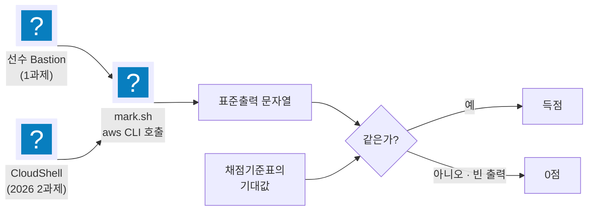

import { Quiz, QuizResults } from 'starlight-quiz/components';

> 문서 유형: explanation

지방대회 채점은 사람이 콘솔을 둘러보는 게 아니다. **정해진 `aws` CLI 명령을 실행해 표준출력 문자열을 기대값과 대조한다.** 2024·2026은 그 명령을 그대로 담은 `mark.sh` 를 채점자에게 배포한다.

이 사실 하나에서 이 대회의 거의 모든 감점 규칙이 나온다.



**이 그림에 콘솔 화면은 없다.** 판정에 쓰이는 것은 CLI 표준출력뿐이다.

## 1. 채점의 실제 모양

2026 1과제 `mark.sh` 는 이렇게 생겼다.

```bash
#!/bin/bash
ACCOUNT_ID=$(aws sts get-caller-identity --query Account --output text)
aws configure set region ap-northeast-2

# 1-1
echo ====================
echo "       1-1        "
echo ====================
aws ec2 describe-vpcs --filter Name=tag:Name,Values=worldpay-app-vpc --query Vpcs[].VpcId --output text
```

항목 번호를 찍고, 명령 하나를 돌리고, 다음 항목으로 간다. 채점자는 출력이 채점기준표의 기대값과 같은지만 본다. 조건 분기도 점수 계산도 없다 — **판정은 사람이 눈으로 한다.**

여기서 세 가지가 따라 나온다.

1. **출력이 비면 0점이다.** 리소스가 있어도 필터에 안 걸리면 없는 것과 같다.
2. **출력이 더 많아도 위험하다.** 기대값이 하나인데 둘이 나오면 채점자가 어느 쪽을 정답으로 볼지 알 수 없다.
3. **콘솔에서 잘 보이는 것은 아무 의미가 없다.** 판정 기준은 CLI 출력뿐이다.

## 2. Name 태그가 정본이다

채점 명령의 압도적 다수가 이 형태다.

```bash
aws ec2 describe-vpcs --filter Name=tag:Name,Values=worldpay-app-vpc ...
aws ec2 describe-subnets --filter Name=tag:Name,Values=worldpay-app-subnet-a ...
aws ec2 describe-route-tables --filter Name=tag:Name,Values=worldpay-pub-rt ...
```

`--filter Name=tag:Name,Values=...` 는 **Name 태그**로 거른다. 콘솔에서 보이는 이름은 대부분 이 Name 태그를 렌더한 것이지만, 서비스에 따라 별개인 것이 있다.

| 리소스 | 채점이 보는 것 |
| --- | --- |
| VPC·서브넷·라우팅 테이블·NACL·Peering·인스턴스 | Name **태그** |
| ALB | `--names` (실제 이름, 태그 아님) |
| ASG | `AutoScalingGroupName` (실제 이름) |
| RDS | `--db-cluster-identifier` (식별자) |
| ECS 클러스터·서비스·TaskDef | 실제 이름 |
| DynamoDB | 테이블 이름 |
| EFS | `FileSystems[].Name` — **Name 태그가 이 필드로 나온다** |
| Secrets Manager | `--filters Key=name` |
| Lambda·Layer | 함수·레이어 이름 |
| Athena 워크그룹·Glue DB/테이블 | 실제 이름 |

**태그로 거르는 것과 이름으로 거르는 것을 구분한다.** 태그 기반 리소스는 이름을 아무리 예쁘게 지어도 Name 태그가 없으면 안 잡힌다. 이름 기반 리소스는 태그를 달아도 소용없다.

### 오타 하나가 통째로 0인 이유

2026 1과제 VPC 항목은 12개 세부항목 15.5점이다. 그중 최소 8개가 Name 태그 필터를 탄다. `worldpay-pub-subnet-a` 를 `worldpay-public-subnet-a` 로 만들면 서브넷 항목(1.5)과 라우팅 항목(1.5)이 같이 날아간다. **리소스는 완벽한데 이름만 틀려서 3점을 잃는다.**

훈련 규칙 하나 — **이름표는 과제지에서 복사해 붙여 넣는다. 절대 손으로 타이핑하지 않는다.**

## 3. 계정 전체를 훑는 명령 — 잔여 리소스가 감점이 된다

일부 명령은 필터가 없다. 계정 전체를 본다.

```bash
# 2026 1-11 : 두 개의 vpc id가 출력되는지 확인
aws ec2 describe-flow-logs --query FlowLogs[].ResourceId --output text

# 2026 2-1 : "worldpay-asg" 인지 확인
aws autoscaling describe-auto-scaling-groups --query AutoScalingGroups[].AutoScalingGroupName --output text

# 2026 3-2 : 모두 "db.t3.medium" 인지 확인
aws rds describe-db-instances --query DBInstances[].DBInstanceClass --output text

# 2026 3-5 : 모두 "False" 인지 확인
aws rds describe-db-instances --query DBInstances[].PubliclyAccessible --output text

# 2026 2과제 1-4 : "sharing-efs" 인지 확인
aws efs describe-file-systems --query FileSystems[].Name --output text

# 2026 2과제 3-1 : "catalog", "secret" 인지 확인
aws dynamodb list-tables --query TableNames --output text
```

연습하다 남긴 리소스가 여기 섞여 나온다. **RDS를 하나 더 띄워 두고 지우지 않았으면 3-2가 `db.t3.medium db.t3.micro` 를 뱉고, "모두 db.t3.medium" 조건이 깨진다.** 실물은 완벽한데 옆에 있던 잔해 때문에 잃는 점수다.

`describe-flow-logs` 는 더 고약하다. 기대값이 "vpc id 2개"라서 Default VPC에 Flow log를 켜 둔 적이 있으면 3개가 나온다.

→ 종료 전 정리는 [체크리스트](/drill/10-checklist/)에 목록으로 있다.

## 4. 인덱스 0만 보는 명령

```bash
aws ec2 describe-subnets --filter Name=tag:Name,Values=worldpay-app-subnet-a \
  --query "Subnets[0].CidrBlock" --output text
```

`Subnets[0]` — **같은 Name 태그의 서브넷이 여럿이면 하나만 본다.** 어느 것이 [0]인지는 보장되지 않는다. 같은 이름표를 두 번 쓰지 않는다.

## 5. 문자열 포함 검사 vs 일치 검사

기대값 문구를 읽을 때 "인지 확인"과 "포함하는지 확인"을 구분한다.

| 유형 | 예 | 의미 |
| --- | --- | --- |
| 일치 | "출력되는 결과가 `worldpay-asg` 인지 확인" | 정확히 그 문자열. 다른 게 섞이면 안 됨 |
| 포함 | "출력되는 결과가 `worldpay-app` 을 **포함**하는지 확인" | 다른 인스턴스가 같이 나와도 됨 |
| 전칭 | "출력되는 결과가 **모두** `t3.micro` 인지 확인" | 하나라도 다르면 실패 |
| 부정 | "`0.0.0.0/0` 을 **포함하지 않는지** 확인" | 하나라도 있으면 실패 |

2026 1과제 2-3은 포함 검사라 다른 EC2가 있어도 되지만, 2-4는 `AutoScalingGroups[].Instances[].InstanceType` 전칭 검사라 ASG 안에 다른 타입이 섞이면 실패한다.

## 6. 실제 동작을 시키는 항목

리소스 존재 확인이 아니라 **앱을 실제로 호출하는** 항목이 매년 있다. 배점이 몰려 있고, 앞 단계가 하나라도 어긋나면 통째로 죽는다.

2026 1과제 6-1~6-3:

```bash
ALB_ENDPOINT=$(aws elbv2 describe-load-balancers --names worldpay-alb --query LoadBalancers[].DNSName --output text)
output=$(curl -s http://$ALB_ENDPOINT/v1/users -H "Content-type: application/json" -d '{"name": "marking-user", "age": 999}')
uid=$(echo $output | grep -o '"uid":[0-9]*' | grep -o '[0-9]*')
curl -s http://$ALB_ENDPOINT/v1/users?uid=$uid
curl -sI http://$ALB_ENDPOINT/v1/users123 | head -n1     # 403 이어야 함
```

여기가 통과하려면 앞의 전부가 살아 있어야 한다 — ALB 리스너, 타깃 그룹 헬스, ASG 인스턴스, 앱 기동, Secrets Manager 값, RDS 접속, 테이블 존재. **7-3(로그 전송 확인)은 6-1에서 넣은 `marking-user` 를 로그에서 찾는다.** 6이 죽으면 7-3도 같이 죽는다.

이 사슬을 **연쇄 항목**이라고 부른다. 항목별 배점은 작아 보이지만 실제로는 뭉텅이다.

| 해 | 연쇄 | 걸린 점수 |
| --- | --- | --- |
| 2025 1과제 | DynamoDB 3-6 → 3-7 → 로그 4-7 | 4.5 |
| 2025 2과제 ② | Pod 1개(2-3) → 확장(2-8) → 축소(2-9) | 4.5 |
| 2026 1과제 | 앱 6-1 → 6-2 → 로그 7-3 | 4.5 |
| 2026 2과제 ① | 마운트 1-8 → 파일 1-9 → 공유 1-10 | 4.5 |
| 2026 2과제 ④ | Lambda 4-9 → 4-10 | 3.0 |

**연쇄의 첫 항목을 최우선으로 살린다.** 옵션 켜기는 나중에 해도 되지만 앱이 안 뜨면 뒤가 전부 0이다.

## 7. 채점기준의 오류를 알고 있어야 한다

과제지·채점기준은 사람이 쓴 문서고 실제로 틀린 곳이 있다. 미리 알면 당황하지 않는다.

| 해 | 위치 | 내용 |
| --- | --- | --- |
| 2023 | 1과제 7절 | "모든 컨테이너는 EC2에서 실행" 과 "모든 서비스는 Fargate에서 실행"이 같은 절에 공존. 채점은 Fargate 기준 |
| 2025 | 1과제 채점 2-1 | 명령은 `--cluster ws-cluster` 인데 기대값이 `wsi-cluster` 로 적혀 있다 |
| 2025 | 1과제 채점 2-10 | `--cluster wsi-ecs` — 문제지의 클러스터 이름은 `ws-cluster` 다 |
| 2025 | 1과제 채점 1-7 | `LoadBalancers[?LoadBalancerName==gateway-alb-pub']` — 따옴표 짝이 안 맞는다 |
| 2025 | 1과제 채점 3-6 | `--query Subnets[].Tags[?Key==\`Name\`]` 대상이 `skills-public-subnet-a` 인데 문제지는 `korea-public-subnet-a` |
| 2026 | 1과제 채점 1-12, 8-1 | 기대값이 `"?"` 로 비어 있다. 실제로는 `com.amazonaws.ap-northeast-2.secretsmanager` 와 `worldpay-dashboard` |
| 2026 | 2과제 배점표 2-2·2-4 | "S3 로깅 버킷 생성", "Athena logging 설정" 인데 채점 내용은 결과 버킷 확인이다 |
| 2026 | 2과제 채점 2-9·2-10 | 기대값 3.8·4.5. **배포된 CSV로 실제 계산하면 4.05·4.33이다** |

마지막 줄이 특히 중요하다. `survey.csv` 20행의 response 평균은 4.05, salary ≥ 70000인 6명(115~120)의 평균은 4.333…이다. **채점기준에 적힌 3.8·4.5는 다른 데이터로 만든 값이다.** 대회장에서 이 숫자가 안 맞는다고 쿼리를 고치면 오히려 틀린다. 쿼리를 데이터 기준으로 맞게 쓰고, 계산 근거를 남겨 이의신청 자료로 쓴다.

**규칙: 문제지와 채점기준이 다르면 채점기준을 따른다. 채점기준이 데이터와 다르면 데이터를 따르고 근거를 남긴다.**

## 8. 배점이 말하는 우선순위

### 8-1. 4년치 배점 상위 항목

| 해 | 1위 | 2위 | 3위 |
| --- | --- | --- | --- |
| 2023 | ECS 16.5 | CloudFront 10.5 | Target Group 9 |
| 2024 | ElastiCache 13.5 | DocumentDB 12 | ECR·EKS·ASG 각 6 |
| 2025 | Container 20 | Network·Database·Monitoring 각 10 | — |
| 2026 | VPC 15.5 | RDS 7 | ASG 6.5 |

공통점은 **"그해의 주역 서비스"에 배점의 3분의 1 안팎이 몰린다**는 것이다. 문제지 앞머리의 Software Stack 목록에서 가장 낯선 서비스가 대개 그 주역이다.

### 8-2. 싼 점수와 비싼 점수

| 성격 | 항목 예 | 점당 시간 |
| --- | --- | --- |
| 싸다 | 태그 붙이기, 보관 기간 설정, 삭제 방지, 암호화 체크박스, 대시보드 위젯 | 분 단위 |
| 중간 | 서브넷·라우팅·NACL, ASG 정책, Secrets Manager | 십 분 단위 |
| 비싸다 | 앱 기동·연쇄 항목, KEDA 확장·축소, Client VPN 실연결, Terraform apply | 시간 단위 |

**싼 점수부터 훑고 비싼 것으로 간다** — 는 잘못된 조언이다. 연쇄 항목은 시간이 오래 걸리는 만큼 늦게 시작하면 못 끝낸다. 실제 순서는 이렇다.

```
1) 연쇄의 뿌리를 먼저 세운다 (VPC → 보안 그룹 → DB → 앱 → ALB)
2) 앱이 curl로 응답하는 것을 확인한다      ← 여기까지가 상반부 2시간
3) 그 다음 싼 점수를 훑는다 (태그·암호화·보관기간·대시보드)
4) 남은 시간에 나머지
```

2)를 못 넘긴 채로 3)만 채우면 배점표의 절반이 남는다.

## 9. 채점 전 스스로 돌리는 법

**mark.sh 를 그대로 써서 자가 채점한다.** 2024·2026 자료에 실제 배포된 스크립트가 있고, 없는 해도 채점기준표의 명령을 그대로 옮기면 만들 수 있다.

훈련할 때 습관:

```bash
# 과제 종료 30분 전, Bastion 또는 CloudShell 에서
bash mark.sh 2>&1 | tee /tmp/self-mark.txt
```

그리고 항목 번호를 하나씩 채점기준표와 대조한다. **출력이 빈 항목을 먼저 고친다** — 빈 출력은 확실한 0점이고, 대개 이름표 오타나 리전 문제라 몇 분이면 고친다.

자기 채점 스크립트를 미리 만들어 두는 것 자체가 훈련이다. 채점기준표를 읽고 스크립트로 옮기는 과정에서 "이 항목이 뭘 보는지"가 손에 남는다.

## 10. 자기 점검

<Quiz title="빈 출력이 뜻하는 것">
채점 명령이 아무것도 출력하지 않았다. 가장 먼저 의심할 것은?

- [x] Name 태그 철자 또는 리전 — 리소스는 있는데 필터에 안 걸린 경우
- [ ] 리소스를 아직 안 만든 것
  > 그럴 수도 있지만 대회에서는 만들어 놓고 못 찾는 경우가 훨씬 많다. 만든 기억이 있으면 이름과 리전부터 본다.
- [ ] 채점 스크립트의 버그
  > 2024·2026 mark.sh 는 실제 배포본이다. 자기 환경을 먼저 의심한다.
- [ ] IAM 권한 부족
  > 권한이 없으면 빈 출력이 아니라 AccessDenied 오류가 난다.

**빈 출력은 확실한 0점이고 대개 몇 분이면 고친다.** 자가 채점에서 빈 출력부터 처리하는 이유다.
</Quiz>

<Quiz title="연쇄 항목">
2026 1과제에서 앱이 뜨지 않았다. 함께 잃는 항목을 **모두** 고르시오.

- [x] 6-1 User 생성 (curl POST)
- [x] 6-2 User 조회 (curl GET)
- [x] 7-3 Log 전송 — 6-1 이 넣은 `marking-user` 를 로그에서 찾는다
- [ ] 7-1 Log group 생성
  > 로그 그룹은 이름만 맞으면 되는 독립 항목이다. 앱과 무관하게 득점한다.
- [ ] 3-3 KMS encryption 활성화
  > RDS 옵션 확인이라 앱 기동과 무관하다.

**연쇄는 6-1 → 6-2 → 7-3 으로 4.5점이다.** 그래서 앱을 살리는 일이 옵션 켜기보다 먼저다.
</Quiz>

<QuizResults />

## 11. 리전

- 1과제는 4년 내내 서울(ap-northeast-2).
- 2과제는 2025·2026 모두 **한 문제가 도쿄(ap-northeast-1)** 다.
- 2026 2과제 채점기준 첫 줄: "각 문제마다 채점하는 AWS region이 다를 수 있습니다."

`mark2-1.sh` 는 `aws configure set region ap-northeast-1`, `mark2-2.sh` 는 `ap-northeast-2` 로 시작한다. **리전이 다른 문제는 CloudShell 창을 따로 연다.** 콘솔 리전 표시를 확인하는 습관이 점수다.
